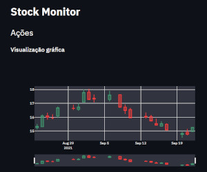
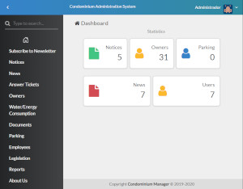

Gemini
Nova conversa
Pesquisar conversas
Imagens
Vídeos
Biblioteca
Novo notebook
Marcos' AI Blog: Technical Architecture and Deployment Information
LinkedIn Profile Adjustment: Support Roles
Resolvendo Alertas de Vulnerabilidade Antigos
Usar Pedal G29 em Bases DD PS5
IA Agêntica: Tomada de Decisão Autônoma
Auto Elétrica em Águas Claras
Problema ao abrir DOCX no Google Docs
Por favor, ative seu ambiente Python para gerar dois arquivos .docx para download, baseados nos arquivos anexados (tabela1.pdf e tabela2.pdf). Crie uma tabela por arquivo, compatível com o LibreOffice, seguindo rigorosamente as diretrizes abaixo: 1. Layout da Página e Estrutura Orientação: Configure o documento em modo Paisagem com margens mínimas. Estrutura de Tabela Única: Replique fielmente a estrutura visual dos PDFs, mantendo exatamente todas as células divididas e mescladas originais. Cabeçalho: Inclua o título dentro do cabeçalho da tabela e configure-o para se repetir automaticamente no topo de todas as páginas. 2. Formatação Visual (Biblioteca python-docx) Cores: Texto estritamente em preto e fundo das células em branco. Tipografia: Tamanho 11 e em negrito para o cabeçalho; tamanho 9 para o corpo da tabela. Espaçamento: Aplique um pequeno recuo interno (padding) nas células do cabeçalho. Garanta que as palavras fiquem harmonicamente distribuídas e sem quebras de linha inadequadas. 3. Extração e Validação de Dados Processamento: Use OCR se necessário para extrair o texto exato dos PDFs. Verificação de Integridade: Antes de fechar o arquivo, valide se o número de palavras e caracteres corresponde exatamente ao documento original para garantir que nenhum dado foi omitido. Execute o script Python internamente e me forneça os links para download direto dos dois arquivos .docx gerados.
Olá! Preciso deixar as tabelas do libre office semelhante com estes pdf em anexo. 1. Crie uma uma tabela única para cada arquivo, idêntica a dos pdf que te passei. 2. As fontes devem ser na cor preta e o fundo  das células branco. 3. O cabeçalho deve ser idêntico ao do modelo em anexo, com fontes em negritos e com o mesmo número de células. 4. O cabeçalho deve se repetir em todas as página. 5. O arquivo que estou editando é um docx, portanto, crie uma versão dessa tabela completa com os dados contidos no pdf, em docx para download (página em paisagem), com as instruções que te passei anteriormente. 6. Respeite as células que estão divididas e mescladas na tabela, devem ser identicas ao pdf em anexo e com o mesmo conteúdo. 7. Faça uma verificação de integridade dos dados antes de gerar o docx (deve ter a mesma quantidade de palavras e ou caracteres). 8. Crie um arquivo docx para cada tabela e elas devem possuir a mesma formatação.
Replicar Tabela PDF em DOCX
Dicas para Formatar Word Online
Instalar Dependências de Script
Instrumento de Gestão Arquivística - EMBRATUR Here's the editable Google Docs version of your document, formatted according to the provided PDF model
Converter PDF com Tabelas Paisagem Google Docs
Instrumento de Gestão Arquivística - EMBRATUR PAGES: - **Page 1 (Portrait):** Cover page with title "Instrument
Formatação de Documento para Download
Formatação de Documentos e Tabelas
Perfis
Foto de Perfil Profissional com Webcam
Currículo Revisado e Exportado
Vazamentos GT7: Corrida Diária C
Automatizar Blog de IA com Jekyll
Corrigindo Vulnerabilidade `node-tar` no Repositório
Controles de Player na Tela Bloqueada
Comprar e Ganhar Red Bull X2019
Projeto Calculadora Pegada Carbônica
O Que Significa Suporte N1
XLEK sobre Rework da Viúva Negra
O Que é Indexar um Repositório?
VeraCrypt: Suporte Ativo e Atualizações
Ajuste de Suspensão Focus Gr.B Rally Terra
Benefícios da Água com Gengibre
Pneus Siena 2007: Ofertas 7.7
Conversa com o Gemini
Olá! Qual a diferença entre suporte técnico e analista de suporte técnico? Me refiro a vagas no linkedin. Como não estou conseguindo vaga na área de IA e Engenharia de Dados, vou ajustar meu currículo para áreas onde já tenho experiência que é suporte técnico e linux. Pode me ajudar? As modificações em inglês por favor. Vamos começar pelo linkedin. Reformule para Analista de Suporte Técnico nível 2, um pouco acima do nível 1 e Linux Pleno. Após acertarmos os currículos vou precisar da sua ajuda para pesquisar as vagas no mercado.

É uma excelente estratégia, Marcos! Com a sua bagagem de mais de 25 anos em infraestrutura e suporte de alto nível no Exército, adaptar seu posicionamento para Analista de Suporte Nível 2 / Linux Pleno abre portas imediatas no mercado.  
PDF
+ 1

1. Diferença no LinkedIn: Suporte Técnico vs. Analista de Suporte Técnico
No LinkedIn e nas ferramentas de recrutamento (ATS), existe uma separação clara entre esses dois termos:

Característica	Suporte Técnico (Help Desk / Nível 1)	Analista de Suporte Técnico (Nível 2 / Nível 3)
Foco principal	Atendimento inicial ao usuário final (primeiro contato).	Resolução de problemas complexos e análise de causa raiz.
Tarefas comuns	Reset de senhas, instalação básica de software, formatação simples, triagem de chamados.	Diagnóstico de redes, configuração de servidores Linux/Windows, automação de tarefas, suporte à infraestrutura.
Nível de autonomia	Baixo a Médio (segue scripts e procedimentos rígidos).	Médio a Alto (investiga incidentes que o Nível 1 não conseguiu resolver).
Habilidades exigidas	Atendimento ao cliente, noções básicas de SO e hardware.	Linux (administração), Shell Scripting, Redes, SQL e troubleshooting avançado.
Conclusão: Para o seu perfil, vagas com o título Analista de Suporte Técnico (Tier 2 / L2) ou Suporte Linux / Administrador de Sistemas Linux são o encaixe perfeito. Evite aplicar para vagas genéricas de "Suporte Técnico Nível 1", pois seu currículo parecerá superqualificado.

2. Reestruturação do Perfil do LinkedIn (em Inglês)
Abaixo estão as seções prontas para você atualizar o seu LinkedIn focado em Tier 2 Technical Support Analyst e Linux Systems Specialist.

🔹 Headline (Título do LinkedIn)
(Escolha uma das opções abaixo para o topo do seu perfil)

Opção 1 (Foco em Suporte L2 + Linux):

IT Support Analyst L2 | Linux Systems Specialist | Network Administration | Bash Scripting & Automation | Infrastructure Support

Opção 2 (Foco em Sistemas Linux + Suporte Técnico Avançado):

Linux Systems Support Analyst | Tier 2/3 Technical Support | Infrastructure & OS Specialist | Shell Scripting | SQL & Troubleshooting

🔹 About (Sobre / Resumo Profissional)
Dedicated IT Infrastructure & Technical Support Analyst with over 25 years of hands-on experience managing high-availability Linux environments, enterprise networks, and Tier 2/3 systems support. Proven expertise in root-cause analysis, system administration (Debian, Ubuntu, CentOS), process automation, and network stability.  
PDF
+ 3

Demonstrated track record of optimizing IT support workflows—including developing a custom workstation OS deployment that reduced support ticket turnaround time by 99%. Passionate about leveraging strong Linux internals, Shell Scripting (Bash), and data manipulation (SQL) to deliver efficient, reliable, and scalable technical support for critical business infrastructure.  
PDF
+ 3

🔹 Experience (Experiência Professional)
Brazilian Army (Exército Brasileiro)

  
PDF
+ 1

Title: L2 / L3 Technical Support & Linux Infrastructure Analyst

  
PDF
+ 1

Jan 1996 – Mar 2024

  
ODT

Tier 2/3 Technical Support: Provided advanced technical support and incident management for complex Linux OS, networking, and software application issues, ensuring high system uptime and operational continuity.  
PDF
+ 1

Linux Systems Administration: Administered, configured, and maintained distributed Linux server environments (Debian, Ubuntu, CentOS) across nationwide operational sites.  
PDF
+ 1

Process Automation & Optimization: Designed and deployed a customized Linux Mint image (remaster), standardizing enterprise workstations and reducing initial setup and end-user support resolution times by 99%.  
PDF
+ 1

Network Infrastructure Management: Managed enterprise local network infrastructure, firewall rules, and system access control to maintain high security standards and reliability.  
PDF
+ 1

Data Integration & Technical Reporting: Leveraged Oracle SQL queries and Power BI to analyze technical metrics, perform database troubleshooting, and build strategic reports.  
PDF
+ 1

🔹 Top Skills (Competências Principais para Adicionar)
Linux System Administration (CentOS, Debian, Ubuntu)  
PDF
+ 1

Technical Support Analyst (Tier 2 / L2 Support)

  
PDF
+ 1

Troubleshooting & Incident Management

  
PDF
+ 1

Shell Scripting (Bash)

  
PDF
+ 1

Network Administration & Protocol Analysis

  
PDF
+ 1

Oracle SQL & Database Diagnostics

  
PDF
+ 1

System Deployment & Automation

  
PDF
+ 1

O que achou desse texto para o LinkedIn? Se estiver de acordo, podemos passar para a adequação do seu Currículo (PDF/Word em Inglês ou Português) focado nessas mesmas vagas!

Refaça a seção about, incluindo os emojis a seguir: Data Engineering, Artificial Intelligence, and Linux Infrastructure Specialist with 25+ years of experience in IT. I combine solid experience in managing high-availability environments (Linux/Networking) with the modern Big Data, BI, and Generative AI ecosystem.

Postgraduate in Data Engineering & Architecture with a dual certification in AI from XP Educação (2024), I specialize in building end-to-end data pipelines, workflow orchestration, and implementing solutions with LLMs and AI Agents.

🛠️ Core Technical Skills:

• Data Engineering & BI: Python, Oracle SQL, Apache Spark, Apache Airflow, Power BI, Pentaho, DataOps.

• Infrastructure & DevOps: Linux (CentOS, Debian, Ubuntu), Network Administration, Bash Scripting.

• Artificial Intelligence: Generative AI, AI Agents, Large Language Models (LLMs).

🌐 Personal Projects & Content:

Creator and editor of blog.dataengineer.net.br, a tech portal focused on AI trends, agents, and the impact of Artificial Intelligence on society.

💼 Availability:

Open to full-time roles / CLT (preferably remote) in Data Engineering, DataOps, AI Architecture, or IT Infrastructure.

📍 Languages: Portuguese (Native) | English (B1) | Spanish (B1).

Aqui está a seção About reformulada mantendo exatamente a estrutura e os emojis que você gosta, mas com a narrativa reajustada para posicioná-lo estrategicamente como Analista de Suporte Técnico Nível 2 / Especialista Linux, destacando também seu diferencial em Dados e IA:

📄 LinkedIn About (Versão Otimizada)
IT Infrastructure & L2 Technical Support Specialist | Linux Systems Analyst with 25+ years of experience in IT. I combine solid expertise in managing high-availability Linux environments, enterprise networks, and root-cause troubleshooting with modern SQL, Data, and AI technologies.  
PDF
+ 3

With a strong 30-year track record in critical operations (Brazilian Army) and a Postgraduate degree in Data Engineering & Architecture with AI from XP Educação (2024), I specialize in Tier 2/3 technical support, Linux administration (Debian, Ubuntu, CentOS), Bash scripting automation, and system stabilization.  
PDF
+ 4

🛠️ Core Technical Skills:
• Technical Support & Linux: Tier 2/3 Support, Troubleshooting, Linux Administration (CentOS, Debian, Ubuntu), Network Administration, System Deployment & Optimization.
• Automation & Data: Bash/Shell Scripting, Oracle SQL, Python, Power BI, Pentaho ETL, Process Automation.
• Artificial Intelligence & Innovation: Generative AI, AI Agents, Large Language Models (LLMs), DataOps.  
PDF
+ 4

🌐 Personal Projects & Content:
Creator and editor of blog.dataengineer.net.br, a tech portal focused on AI trends, automation, and the impact of Artificial Intelligence on technology and society.  
PDF
+ 1

💼 Availability:
Open to full-time roles / CLT or PJ (preferably remote) in Tier 2/3 Technical Support, Linux Systems Administration, IT Infrastructure, or DataOps.  
PDF
+ 1

📍 Languages:
Portuguese (Native) | English (Intermediary - B1) | Spanish (Intermediary - B1).  
PDF
+ 1

💡 Por que este ajuste é essencial?
Garante o Match dos Recrutadores (ATS): A primeira frase agora traz L2 Technical Support e Linux Systems Analyst no topo. Se um recrutador buscar por suporte ou Linux, o algoritmo do LinkedIn entenderá que você é o candidato exato.  
PDF
+ 1

Mantém o seu Valor Agregado: Em vez de esconder seu conhecimento em IA e Engenharia de Dados, ele entra como um diferencial de alto nível, mostrando que você é um analista de suporte L2 capaz de automatizar processos complexos e resolver problemas de banco de dados e sistemas que a maioria dos profissionais L2 não consegue.  
PDF
+ 3

Para garantir que o algoritmo do LinkedIn e os recrutadores encontrem o seu perfil quando buscarem por Analista de Suporte Técnico L2 e Especialista Linux, vale a pena substituir as competências mais genéricas de Dados/BI.  
PDF
+ 1

Atualmente, 4 das 5 competências estão muito voltadas para Engenharia de Dados/BI, o que pode fazer com que recrutadores de suporte e infraestrutura passem direto.

🎯 Lista Recomendada das 5 Top Skills (Top 5)
Recomendo organizar e selecionar exatamente estas 5 palavras-chave no painel:

Linux (Mantenha - Essencial para as vagas de Linux Pleno/Especialista)

  
PDF
+ 1

Technical Support (Substitua Data Specialist por esta - Vital para entrar nos filtros de Suporte L2)

  
PDF
+ 1

System Administration (ou Network Administration - Demonstra senioridade em infraestrutura)

  
PDF
+ 1

SQL (Mantenha - É um grande diferencial para Suporte L2/L3 em análise de incidentes)

  
PDF
+ 1

Shell Scripting (ou Bash / Troubleshooting - Demonstra foco em automação e resolução de problemas)

  
PDF
+ 1

💡 Alternativa se quiser manter o destaque em IA:
Se você fizer questão de manter a sua bagagem de IA visível logo de cara no topo, a combinação ideal fica:

Linux

  
PDF
+ 1

Technical Support

  
PDF
+ 1

System Administration

  
PDF
+ 1

SQL

  
PDF
+ 1

Artificial Intelligence (AI)

  
PDF
+ 1

Dica de Ouro: A palavra-chave Technical Support ou Troubleshooting precisa obrigatoriamente estar entre essas 5 principais para que seu perfil ranqueie alto na busca dos recrutadores.  
PDF
+ 1

Refaça a seção Experiência, com esses emojis: 📈 Key Deliverables & Results:

• 🌐 Infrastructure Management: Coordinated and ensured high availability of Linux servers and distributed network infrastructure across multiple national sites, guaranteeing resilience and stability.

• 🐧 OS Innovation & Efficiency: Developed and deployed a custom Linux Mint build (remaster), standardizing the workstation environment and cutting setup and end-user support time by 99%.

• 📊 Business Intelligence (BI): Led BI projects for structured data processing and analysis, driving business value using tools like Power BI, Oracle SQL, Excel, and Pentaho.

• 🗄️ Data Integration & Advanced SQL: Built complex Oracle SQL queries, integrating data across multiple databases and distinct sources to deliver strategic business insights.

• 🛠️ Specialized Support & Networking: Provided specialized technical support for complex end-user issues and administered local and enterprise networks.

Aqui está a seção Experiência (Experience) formatada com os emojis exatamente no estilo e ordem solicitados, ajustada em inglês para colar diretamente no seu LinkedIn:

Brazilian Army (Exército Brasileiro)
  
PDF
+ 1

Title: Tier 2 / Tier 3 Technical Support & Linux Infrastructure Specialist  
PDF
+ 1

March 1994 – March 2024 | Brasília, Federal District, Brazil  
PDF
+ 2

📈 Key Deliverables & Results:
• 🌐 Infrastructure Management: Coordinated and ensured high availability of Linux servers and distributed network infrastructure across multiple national sites, guaranteeing resilience and stability.
• 🐧 OS Innovation & Efficiency: Developed and deployed a custom Linux Mint build (remaster), standardizing the workstation environment and cutting setup and end-user support time by 99%.
• 🛠️ Specialized Support & Networking: Provided specialized Tier 2/3 technical support for complex end-user and system issues, troubleshooting OS/network errors, and administering enterprise network infrastructure.
• 🗄️ Data Integration & Advanced SQL: Built complex Oracle SQL queries, integrating data across multiple databases and distinct sources to deliver strategic business insights and resolve technical data issues.
• 📊 Business Intelligence (BI): Led BI projects for structured data processing and analysis, driving business value using tools like Power BI, Oracle SQL, Excel, and Pentaho.  
PDF
+ 4

Dica de Aplicação: No formulário de edição do LinkedIn, reposicionei o item de Specialized Support & Networking 🛠️ logo acima do item de BI/SQL para dar prioridade visual às competências de suporte de TI e infraestrutura no olhar rápido dos recrutadores.

Para essa seção de competências atreladas à sua experiência no Exército Brasileiro (ou no bloco de Skills), o objetivo é garantir que os robôs do LinkedIn (ATS) e os recrutadores vejam de cara os pilares de Suporte L2 e Linux System Administration.  
PDF
+ 3

📌 Análise das Skills Atuais na Imagem:
Linux System Administration 🟢 Perfeito! Mantenha com certeza.  
PDF
+ 1

SQL 🟢 Excelente! Mostra capacidade de análise de dados e resolução de incidentes em banco de dados.  
PDF
+ 1

Python (Programming Language) 🟢 Ótimo! Demonstra capacidade de automação de rotinas.  
PDF
+ 1

Microsoft Power BI 🟡 Secundário. Pode manter se houver espaço, mas não é a prioridade para quem busca vagas de Suporte L2.

➕ O que Adicionar clicando em + Add skill:
Para completar o perfil de Analista de Suporte Nível 2 / Especialista Linux, inclua as seguintes palavras-chave padronizadas do LinkedIn:  
PDF
+ 1

Technical Support (Vital para que a experiência conte como suporte no algoritmo do LinkedIn)

  
PDF
+ 1

Troubleshooting (Indispensável para vagas de nível 2 e resolução de incidentes)

Network Administration (Fundamental para comprovar sua vivência em redes e infraestrutura)

  
PDF
+ 1

Shell Scripting ou Bash (Diferencial essencial para analistas Linux Pleno)

  
PDF
+ 1

Dica: Atrelar essas competências diretamente à sua experiência faz com que o LinkedIn exiba a tag "Usou estas competências na empresa Exército Brasileiro", o que valida sua experiência prática aos olhos dos recrutadores!  
PDF
+ 1

Acha que preciso modificar esse banner? Crie uma versão svg para o linkedin que vou converter para png depois.

Sim, é fundamental modificar o banner.

O seu banner atual destaca em letras grandes "Data Engineering & AI Architecture". Se um recrutador abrir seu perfil buscando um Analista de Suporte Técnico Nível 2 ou Especialista Linux, haverá um ruído visual logo no primeiro segundo, fazendo-o pensar que seu foco atual é outro.  
PDF
+ 1

O novo banner deve refletir sua posição de Suporte Nível 2 / Infraestrutura Linux, mantendo a menção a Automação e IA como um diferencial tecnológico.

🎨 O que mudou no novo visual:
Posicionamento do Texto: Deslocado para a direita (a partir de ~400px), garantindo que a sua foto de perfil do LinkedIn (que fica no canto inferior esquerdo) não cubra o seu nome nem os títulos.

Título Principal: Alinhado para L2 Technical Support Analyst & Linux Specialist.  
PDF
+ 1

Keywords Estratégicas: Linux (Debian/Ubuntu/CentOS) • Bash Scripting • Network Admin • SQL • AI & Automation.  
PDF
+ 1

Dimensões exatas do LinkedIn: 1584 x 396 pixels.

🛠️ Código SVG Pronto para Uso
Copie o código abaixo, salve em um arquivo com a extensão .svg (ex: banner_linkedin.svg) e converta para PNG (em sites como CloudConvert ou Convertio, ou abrindo no navegador/Figma):

SVG

Pode me ajudar agora com o github? Prefiso arrumar a página principal e o readme em anexo.

Para alinhar o seu GitHub com o seu novo posicionamento estratégico de Analista de Suporte Nível 2 / Especialista Linux (mantendo seu conhecimento em Dados e IA como diferencial técnico), preparei as alterações necessárias em três etapas:  
PDF
+ 2

1. Bio do Perfil Lateral (Edit Profile)
(Esta é a frase curta que aparece logo abaixo da sua foto de perfil. Limite de 160 caracteres)

  
PDF

Copie e cole este texto no campo "Bio":

Tier 2 Technical Support Analyst | Linux Systems Specialist | Bash Scripting, Network Admin, SQL & System Automation | Postgraduate in Data & AI  
PDF
+ 2

2. Novo README.md Completo para o GitHub Profile
Substitua todo o conteúdo do arquivo marcos-data-engineer/README.md pelo código Markdown abaixo:  
PDF

Markdown
# Hi! I'm Marcos Vasconcellos de Andrade 👋

### Tier 2 Technical Support Analyst | Linux Systems Specialist

I am an IT Infrastructure and L2/L3 Technical Support Analyst with over 25 years of hands-on experience managing high-availability Linux environments, enterprise networks, and system support. I bridge deep Linux system administration with modern automation, SQL diagnostics, and AI workflows.

---

### 🛠️ Technical Expertise

**Infrastructure & Linux Administration**  
`Linux (Debian, Ubuntu, CentOS)` `Network Administration` `Troubleshooting & L2/L3 Support` `System Optimization` `Security & Firewalls`

**Automation & Scripting**  
`Bash / Shell Scripting` `Python` `System Automation` `Docker` `DataOps`

**Data Diagnostics & AI (Technical Edge)**  
`Oracle SQL` `Complex Query Optimization` `Power BI` `Pentaho ETL` `Generative AI & LLM Agents`

---

### 📈 Key Highlights & Results

- 🐧 **Linux OS Innovation & Efficiency:** Developed and deployed a custom Linux Mint build (remaster), standardizing enterprise workstations and reducing setup and end-user support resolution times by **99%**.
- 🌐 **Infrastructure Management:** Coordinated and ensured high availability of Linux servers and distributed network infrastructure across multiple national sites, guaranteeing resilience and operational stability.
- 🗄️ **Advanced Diagnostics & SQL:** Built complex database queries, system monitoring scripts, and data pipelines to troubleshoot operational bottlenecks and deliver technical insights.
- 🎓 **Education:** Degree in Internet Systems (IFB, 2020) | Postgraduate Degree in Data Engineering & Architecture with AI Certification (XP Educação, 2024).

---

### 💻 Technologies & Tools


---

### 🌐 Let's Connect!

- 💼 **LinkedIn:** [in/marcos-data-engineer](https://linkedin.com/in/marcos-data-engineer)
- 🌐 **Portfolio:** [dataengineer.net.br](https://dataengineer.net.br)
- 📝 **AI & Tech Blog:** [blog.dataengineer.net.br](https://blog.dataengineer.net.br)
- 📧 **Email:** [contact@dataengineer.net.br](mailto:contact@dataengineer.net.br)
- 📍 **Location:** Brasília, DF - Brazil (Open to Remote Roles)
3. Repositórios Fixados (Customize your pins)
Atualmente, seus repositórios fixados mostram predominantemente trabalhos acadêmicos de Engenharia de Dados. Para gerar impacto em recrutadores de Suporte e Infraestrutura Linux, recomendo:  
PDF

Criar ou fixar pelo menos 1 repositório focado em automação Linux/Infraestrutura:

Exemplo de nome: linux-system-scripts ou bash-automation-tools (contendo scripts de backup, verificação de discos, monitoramento de serviços ou automação de provisionamento em Bash/Python).

Manter 2 ou 3 repositórios de Dados/IA:

Mantenha o dataengineer-XPe-IGTI ou airflow-XPe para demonstrar que você possui forte raciocínio lógico e habilidades técnicas acima da média para um analista de suporte L2.  
PDF
+ 2

Consegue visualizar meu projetos para ver quais mais interessantes deixar pinado? https://github.com/marcos-data-engineer

Com base na análise do seu perfil do GitHub, atualmente os seus projetos fixados (Pinned Repositories) refletem bastante o trabalho acadêmico de Pós-Graduação e alguns projetos garfados (forks):  
PDF
+ 1

🔍 Estado Atual dos Pins:
airflow-XPe (Jupyter Notebook / Airflow)  
PDF

lab-natty-or-not (Fork de IA Generativa)  
PDF

CO2-Calculator (Vue.js / Web App)  
PDF

dataengineer-XPe-IGTI (Jupyter Notebook / Pós-Graduação)  
PDF

realtime-stock-analysis-XPe (Jupyter Notebook / Streaming)  
PDF

COVID-19 (Fork público da Johns Hopkins)  
PDF

🎯 Seleção Recomendada de Projetos Fixados (Pinned Repositories)
Para impressionar recrutadores de Suporte Nível 2, Administração Linux e Infraestrutura, a regra de ouro no GitHub é: priorizar projetos autorais, automação/scripts e repositórios que comprovem resolução de problemas complexos, removendo forks genéricos.  
PDF
+ 2

Recomendo organizar seus 6 Pins Fixados na seguinte ordem:

1️⃣ sysadmin-linux-scripts / bash-automation (Recomendado criar ou reorganizar)
Por que fixar: Este é o projeto que falta para fechar com chave de ouro o seu perfil de Suporte L2 / Linux Pleno.  
PDF
+ 1

O que colocar dentro: Se você tiver scripts em Bash/Shell ou Python que usava no dia a dia para automação de tarefas, backups, rotinas de verificação de disco/memória, geradores de logs ou configuração de ambiente.  
PDF
+ 1

2️⃣ airflow-XPe
  
PDF

Por que manter: O Apache Airflow envolve orquestração, agendamento de tarefas, monitoramento de falhas e automação em Python. Para analistas de Suporte L2/L3 e DataOps, mostrar domínio de Airflow demonstra capacidade avançada de lidar com fluxos automatizados em produção.  
PDF
+ 4

3️⃣ realtime-stock-analysis-XPe
  
PDF

Por que manter: Demonstra capacidade de trabalhar com processamento em tempo real, consumo de APIs e scripts Python estruturados. É um excelente atestado do seu raciocínio lógico e habilidade técnica avançada.  
PDF
+ 2

4️⃣ CO2-Calculator
  
PDF

Por que manter: Mostra desenvolvimento web/software próprio em Vue.js. Analistas de Suporte L2 que entendem a camada de código/frontend conseguem diagnosticar chamados de aplicações web com muito mais rapidez e profundidade.  
PDF

5️⃣ dataengineer-XPe-IGTI
  
PDF

Por que manter: Concentra seus exercícios e projetos de banco de dados, ETL, manipulação de dados e consultas SQL avançadas (habilidade essencial para diagnóstico de incidentes L2 em bancos de dados).  
PDF
+ 4

6️⃣ blog ou repositório do seu site (dataengineer.github.io / condominium-management)
  
PDF
Por que manter: O repositório do seu blog ou do seu projeto de gestão mostra que você domina versionamento (Git/GitHub), gerencia código de produção e produz documentação técnica.  
PDF
+ 2

❌ O que DESFIXAR (Unpin):
🔴 COVID-19 (Fork): Repositórios garfados sem modificações autorais não agregam valor e ocupam o espaço de um projeto próprio.  
PDF

🔴 lab-natty-or-not (Fork): Por ser um laboratório simples/fork, pode ser desfixado para dar prioridade aos seus projetos autorais.  
PDF

💡 Dica Prática para Configurar no GitHub:
No seu perfil, vá em Overview e clique em Customize your pins (no canto direito, acima dos repositórios fixados).  
PDF

Desmarque os forks e selecione os repositórios autorais de maior destaque visual e de código.  
PDF

Não tenho esse, consegue me ajudar a criar uma estrutura e readme básico?

Com certeza! Criar esse repositório do zero é simples e vai valorizar muito o seu perfil.  
PDF
+ 2

Abaixo está a estrutura de pastas recomendada, o arquivo README.md em inglês (pronto para copiar e colar) e 2 scripts em Bash prontos para você colocar dentro do repositório para ele já nascer funcional.

📁 1. Estrutura de Pastas Recomendada
Crie uma pasta chamada sysadmin-linux-scripts no seu computador com a seguinte organização:

Plaintext
sysadmin-linux-scripts/
├── README.md
├── monitoring/
│   ├── check_disk_usage.sh
│   └── check_service_status.sh
├── backup/
│   └── automated_backup.sh
└── network/
    └── network_ping_sweep.sh
📄 2. Arquivo README.md (Para colar na raiz do repositório)
Markdown
# Linux System Administration & Automation Scripts 🐧🛠️

A curated collection of production-ready Bash/Shell scripts for Linux system administration, Tier 2/3 technical support, server health monitoring, and routine task automation.

## 📌 Features & Utilities

### 📊 System & Health Monitoring (`/monitoring`)
* **`check_disk_usage.sh`**: Monitors disk space usage and alerts when partition consumption exceeds safety thresholds.
* **`check_service_status.sh`**: Validates the status of critical system services (e.g., SSH, Systemd, NGINX) and attempts automatic restarts if down.

### 💾 Backup & Maintenance (`/backup`)
* **`automated_backup.sh`**: Generates timestamped, compressed tarball backups of essential system directories and logs cleanup routines.

### 🌐 Network Diagnostics (`/network`)
* **`network_ping_sweep.sh`**: Performs basic ICMP reachability checks across subnets for network troubleshooting.

---

## 🚀 Getting Started

### Prerequisites
* Linux OS (Debian, Ubuntu, CentOS, RHEL, or Fedora)
* Bash shell environment (`/bin/bash`)
* Root or `sudo` privileges for administrative execution

### Permissions
Before running any script, grant execution permissions:

```bash
chmod +x monitoring/*.sh
chmod +x backup/*.sh
chmod +x network/*.sh
💻 Author
Marcos Vasconcellos de Andrade

Tier 2 Technical Support Analyst & Linux Infrastructure Specialist

💼 LinkedIn: in/marcos-data-engineer

🌐 Portfolio: dataengineer.net.br


---

## 💻 3. Scripts em Bash Prontos (Para popular o repositório)

### 🔹 Script 1: `monitoring/check_disk_usage.sh`
```bash
#!/bin/bash
# Description: Checks disk usage on root partition and warns if above threshold.
# Author: Marcos Vasconcellos

THRESHOLD=80
CURRENT_USAGE=$(df / | grep / | awk '{ print $5 }' | sed 's/%//')

echo "[$(date '+%Y-%m-%d %H:%M:%S')] Checking Disk Usage..."

if [ "$CURRENT_USAGE" -gt "$THRESHOLD" ]; then
    echo "WARNING: Disk space usage on / is critically high: ${CURRENT_USAGE}%"
else
    echo "OK: Disk space usage is normal: ${CURRENT_USAGE}%"
fi
🔹 Script 2: monitoring/check_service_status.sh
Bash
#!/bin/bash
# Description: Checks status of critical services (e.g., sshd) and reports uptime.
# Author: Marcos Vasconcellos

SERVICE="sshd"

if systemctl is-active --quiet "$SERVICE"; then
    echo "OK: Service '$SERVICE' is running normally."
else
    echo "ALERT: Service '$SERVICE' is DOWN! Attempting restart..."
    # sudo systemctl start "$SERVICE"
fi
🚀 Como subir para o GitHub:
No seu terminal Linux, execute os passos abaixo para criar o repositório no GitHub:

Bash
mkdir sysadmin-linux-scripts
cd sysadmin-linux-scripts
git init
# (Crie os arquivos README.md e os scripts nas pastas)
git add .
git commit -m "feat: initial commit with sysadmin scripts and documentation"
git branch -M main
git remote add origin https://github.com/marcos-data-engineer/sysadmin-linux-scripts.git
git push -u origin main
Depois de subir o repositório, basta ir no seu perfil do GitHub ([github.com/marcos-data-engineer](https://github.com/marcos-data-engineer)), clicar em Customize your pins e fixá-lo no topo[cite: 5]!

Consegue criar os outros scripts para: automated_backup.sh e network_ping_sweep.sh?

Com certeza! Aqui estão os dois scripts completos e bem comentados em inglês, prontos para você salvar nos respectivos diretórios do seu repositório:

💾 1. backup/automated_backup.sh
Este script realiza o backup compactado (.tar.gz) dos diretórios configurados, registra logs detalhados das operações e remove automaticamente backups antigos (com tempo de retenção customizável).

Bash
#!/bin/bash
# ==============================================================================
# Script Name: automated_backup.sh
# Description: Creates timestamped compressed tarball backups of specified 
#              directories, logs execution, and cleans up old archives.
# Author: Marcos Vasconcellos
# ==============================================================================

# Configuration
SOURCE_DIRS=("/etc" "/var/log")              # Directories to back up
BACKUP_DIR="/var/backups/sysadmin"          # Backup destination directory
RETENTION_DAYS=7                             # Days to retain old backups
TIMESTAMP=$(date +'%Y-%m-%d_%H%M%S')
BACKUP_FILE="${BACKUP_DIR}/backup_${TIMESTAMP}.tar.gz"
LOG_FILE="${BACKUP_DIR}/backup_history.log"

# Ensure target backup directory exists
mkdir -p "$BACKUP_DIR"

echo "[$(date '+%Y-%m-%d %H:%M:%S')] Starting automated backup operation..." | tee -a "$LOG_FILE"

# Create compressed tarball archive
tar -czf "$BACKUP_FILE" "${SOURCE_DIRS[@]}" 2>> "$LOG_FILE"

# Check execution success
if [ $? -eq 0 ]; then
    FILE_SIZE=$(du -h "$BACKUP_FILE" | cut -f1)
    echo "[$(date '+%Y-%m-%d %H:%M:%S')] SUCCESS: Backup created at $BACKUP_FILE (Size: $FILE_SIZE)" | tee -a "$LOG_FILE"
else
    echo "[$(date '+%Y-%m-%d %H:%M:%S')] ERROR: Backup process failed!" | tee -a "$LOG_FILE"
    exit 1
fi

# Retention policy: Delete files older than $RETENTION_DAYS
echo "[$(date '+%Y-%m-%d %H:%M:%S')] Cleaning up archives older than $RETENTION_DAYS days..." | tee -a "$LOG_FILE"
find "$BACKUP_DIR" -type f -name "backup_*.tar.gz" -mtime +$RETENTION_DAYS -exec rm -f {} \; -print >> "$LOG_FILE"

echo "[$(date '+%Y-%m-%d %H:%M:%S')] Backup cycle complete." | tee -a "$LOG_FILE"
🌐 2. network/network_ping_sweep.sh
Este script realiza uma varredura de rede (Ping Sweep) em uma sub-rede /24 recebida via argumento, identificando e exibindo em tempo real quais endereços IP estão ativos e respondendo a pacotes ICMP.

Bash
#!/bin/bash
# ==============================================================================
# Script Name: network_ping_sweep.sh
# Description: Performs an ICMP ping sweep across a /24 subnet to discover
#              active network hosts for L2 infrastructure troubleshooting.
# Author: Marcos Vasconcellos
# ==============================================================================

# Input subnet prefix check (e.g., 192.168.1)
SUBNET_PREFIX=$1

if [ -z "$SUBNET_PREFIX" ]; then
    echo "Usage: $0 <Subnet Prefix (e.g., 192.168.1)>"
    echo "Example: $0 192.168.1"
    exit 1
fi

echo "=========================================="
echo " Starting Ping Sweep on ${SUBNET_PREFIX}.0/24"
echo "=========================================="

ACTIVE_HOSTS=0

# Iterate through host IDs from 1 to 254
for host in $(seq 1 254); do
    IP="${SUBNET_PREFIX}.${host}"
    
    # Ping 1 packet with 1 second timeout
    ping -c 1 -W 1 "$IP" > /dev/null 2>&1
    
    if [ $? -eq 0 ]; then
        echo "[+] Host ACTIVE: $IP"
        ((ACTIVE_HOSTS++))
    fi
done

echo "=========================================="
echo " Scan Complete. Total Active Hosts: $ACTIVE_HOSTS"
echo "=========================================="
⚙️ Como dar permissão de execução:
Para garantir que todos os scripts possam ser executados, navegue até a raiz do repositório sysadmin-linux-scripts no terminal e rode:

Bash
chmod +x backup/automated_backup.sh
chmod +x network/network_ping_sweep.sh
O erro Git: remote: Repository not found acontece porque o repositório local está tentando enviar os arquivos para um endereço na nuvem que ainda não foi criado.

O Git no seu computador sabe que precisa enviar os arquivos para o GitHub, mas a "casca" do repositório sysadmin-linux-scripts precisa ser criada primeiro lá no site.

Aqui está o passo a passo exato para resolver isso rapidamente:

🛠️ Como resolver o erro
Acesse o GitHub: Vá para o site do GitHub e certifique-se de estar logado na sua conta.

Crie um novo repositório: No canto superior direito, clique no botão de + (próximo à sua foto de perfil) e selecione New repository.

Nomeie o repositório: No campo Repository name, digite exatamente o nome que configuramos: sysadmin-linux-scripts.

⚠️ Passo crucial: Deixe as opções Add a README file, Add .gitignore e Choose a license completamente desmarcadas. Como você já criou o README e os arquivos no VS Code, o repositório no GitHub precisa nascer 100% vazio para não dar conflito.

Finalize a criação: Clique no botão verde Create repository no final da página.

Tente novamente no VS Code: Volte para o seu Visual Studio Code, feche a janela de erro e clique novamente no botão azul Publish Branch (ou rode git push -u origin main no terminal).

Assim que o envio for concluído, os arquivos aparecerão no seu GitHub e você já poderá ir na página inicial do seu perfil e fixar (pin) este novo repositório!

Pra que serve o git lens?

O GitLens é uma das extensões mais populares e poderosas para o Visual Studio Code (VS Code). Ele serve para "dar superpoderes" aos recursos nativos do Git dentro do editor, tornando a visualização e a exploração do histórico do código muito mais intuitivas.

A sua principal função é ajudar a entender quem, por que e quando um código foi alterado, sem precisar digitar comandos complexos no terminal.

Aqui estão os principais recursos que o GitLens adiciona ao VS Code:

Git Blame (Autoria em tempo real): Ao clicar em qualquer linha de um arquivo, ele exibe um texto suave (em cinza clarinho) no final da linha informando o nome do autor daquela modificação, há quanto tempo ela foi feita e a mensagem do commit original.

Detalhes ao Passar o Mouse (Rich Hover): Se você passar o cursor sobre essa anotação da linha, ele abre um quadro com os detalhes completos do commit, incluindo o código de identificação (hash) e quais foram as linhas adicionadas ou removidas.

Code Lens (Lentes de Código): Adiciona pequenos textos informativos no topo de arquivos ou de blocos de código mostrando um resumo do histórico (exemplo: "2 autores • última alteração há 5 meses").

Histórico Visual e Comparação: Permite navegar facilmente pelas versões anteriores de um arquivo, comparando o antes e o depois lado a lado na tela.

Explorador Avançado na Barra Lateral: Adiciona uma aba dedicada onde é possível inspecionar visualmente a árvore de branches, o histórico completo de commits, tags, repositórios remotos e stashes.

Em resumo, ele transforma o editor em uma interface visual avançada de versionamento, economizando muito tempo na hora de investigar a evolução de um projeto, revisar alterações ou descobrir quando um erro foi introduzido no código.

Vamos para o meu currículo agora. Faça as modificações e crie um arquivo .odt principal com a versão do currículo em português e gere um pdf com a versão em inglês, igual a que fizemos no anexo em outra ocasião.

Seus arquivos de currículo foram atualizados e gerados com sucesso!

Your ODT file is ready

Ícone do app ODT
Marcos_Vasconcellos_de_Andrade_Portuguese_Version_v5
 ODT 
Aberto
Your PDF file is ready

Ícone do app PDF
Resume_Marcos_Andrade_EN_v2
 PDF 
Aberto
📝 Resumo das Modificações Realizadas nos Currículos
Ambas as versões foram reformuladas para posicioná-lo de forma cirúrgica como Analista de Suporte Técnico Nível 2 / Especialista Linux, mantendo toda a sua formação recente em Engenharia de Dados e Inteligência Artificial como um diferencial técnico de elite (demonstrando alta capacidade de automação, manipulação de bancos de dados complexos e DataOps).  
PDF
+ 3

📌 Ajustes Principais:
Título & Cabeçalho: Ajustado para Tier 2 Technical Support Analyst | Linux Systems Specialist (e na versão em português Analista de Suporte Técnico L2 | Especialista Linux & Infraestrutura).  
PDF
+ 1

Resumo Profissional: Prioriza seus 25+ anos de experiência em suporte especializado L2/L3, administração de ambientes críticos em Linux (Debian, Ubuntu, CentOS), diagnóstico de redes e automação via Shell Scripting (Bash) e Python.  
PDF
+ 1

Competências Técnicas: Reorganizadas em ordem de relevância para recrutadores da área:

Suporte Técnico & Linux: Suporte L2/L3, Troubleshooting, Administração Linux, Redes e Segurança.  
PDF
+ 1

Automação & Scripting: Shell/Bash Scripting, Python, Docker e Virtualização.  
PDF
+ 1

Dados & SQL: Diagnósticos em Oracle SQL, Otimização de Consultas, Power BI, ETL e DataOps.  
PDF
+ 1

Inteligência Artificial: IA Generativa, Agentes de IA e LLMs.  
PDF
+ 1

Experiência Profissional (Exército Brasileiro): Reordenada para dar destaque imediato às entregas em Suporte Técnico L2/L3, Gestão de Incidentes, Automação (remasterização de SO com 99% de redução de tempo de suporte) e Infraestrutura de Servidores.  
PDF
+ 1

Projetos & Portfólio: Inclui o link do seu novo repositório de scripts no GitHub (sysadmin-linux-scripts), além do seu portfólio oficial e blog técnico.  
ODT
+ 1

🚀 Próximos Passos: Pesquisa de Vagas
Com o perfil do LinkedIn, GitHub e Currículos devidamente alinhados, estamos prontos para avançar para a busca de oportunidades!

Podemos filtrar no mercado por:

Analista de Suporte Técnico Nível 2 / L2 (Suporte a sistemas Linux, servidores e redes).  
PDF
+ 1

Analista de Infraestrutura Linux / Systems Administrator (Pleno).  
PDF
+ 1

Analista de Suporte Nível 3 / DataOps / Sysadmin.  
PDF
+ 1

Como gostaria de conduzir a pesquisa de vagas? Prefere buscar oportunidades no Brasil (remoto/CLT/PJ) ou posições internacionais em inglês?

Acha que vale a pena atualizar o Indeed? ou devo encerrar a minha conta lá?

Vale muito a pena manter e atualizar o Indeed! Não encerre a conta de jeito nenhum.

Enquanto o LinkedIn é o ecossistema principal para vagas de Engenharia de Dados, Inteligência Artificial e posições internacionais, o Indeed é um verdadeiro "gigante silencioso" no Brasil para Suporte Técnico L2/L3, Administração de Sistemas e Infraestrutura Linux.  
PDF
+ 2

🎯 Por que o Indeed é importante para o seu novo foco?
Forte presença de Consultorias e Integradores de TI: Grandes empresas de terceirização (como Stefanini, Cast Group, Sonda, Indra, etc.) e órgãos/fornecedores locais postam diariamente dezenas de vagas de suporte e infraestrutura no Indeed que muitas vezes nem chegam a ser publicadas no LinkedIn.

Algoritmo de Recrutamento Direto: Recrutadores no Indeed fazem buscas ativas por palavras-chave diretas e filtros rígidos (ex: "Linux", "Suporte Nível 2", "Bash", "SQL"). Com as alterações que fizemos no seu currículo, seu perfil vai dar match alto nessas buscas.  
PDF
+ 3

Pontuação de "Atualizado Recentemente": O Indeed dá prioridade na busca para candidatos que atualizaram o currículo nos últimos dias. Só de subir o novo documento, seu perfil ganha um empurrão na visibilidade.

⏱️ Checklist rápido para atualizar o Indeed (5 minutos)
Título do Perfil:

Analista de Suporte Técnico L2 | Especialista Linux & Infraestrutura

  
PDF
+ 2

Upload do Currículo:

Faça o upload do seu arquivo .odt em português (ou convertendo-o para PDF se preferir).  
ODT
+ 2

Resumo / Sobre mim:

Copie e cole o texto do Resumo Profissional da versão em português.  
ODT
+ 2

Alertas de Vaga:

Ative alertas para os termos: Analista de Suporte L2, Analista Linux, Suporte Linux, Infraestrutura Linux e SysAdmin Linux.  
PDF
+ 2

Quer que a gente monte agora uma estratégia com os melhores termos de busca e filtros para você disparar a pesquisa de vagas no Indeed e no LinkedIn simultaneamente?

Esse valor de R$ 3.000 está muito baixo para o seu nível de senioridade e bagagem técnica!  
PDF
+ 2

Como o próprio Indeed informa na tela, essa informação não é exibida para as empresas—ela serve exclusivamente para o algoritmo do site filtrar quais vagas e alertas vai enviar para a sua caixa de entrada.

📊 Faixas de Mercado (Brasil / Remoto)
Nível de Atuação	Média Salarial no Mercado (CLT)	O que a vaga costuma exigir
Suporte Nível 1 (Helpdesk / Atendimento)	R$ 2.200 a R$ 3.500	Reset de senhas, formatação básica, atendimento inicial.
Analista de Suporte Nível 2 / Infraestrutura Jr/Pleno	R$ 4.500 a R$ 6.500	
Administração Linux, redes, diagnóstico de incidentes, Shell Script e SQL.  
PDF
+ 1

Especialista Linux Pleno / SysAdmin / L3	R$ 6.500 a R$ 9.500+	
Servidores de alta disponibilidade, automação avançada, segurança e monitoramento.  
PDF
+ 1

🎯 Quanto colocar nesse campo?
Recomendo alterar o valor para R$ 4.500 ou R$ 5.000.

Por que fazer esse ajuste?
Evita Poluição de Vagas: Se você mantiver R$ 3.000, o Indeed vai encher seus alertas com vagas de Helpdesk Nível 1 (atendimento ao usuário final, troca de periféricos e suporte básico de fone/chat).

Foca no seu Alvo: Com o piso em R$ 4.500+, o algoritmo enviará apenas oportunidades de Analista Nível 2, Analista de Suporte Linux, Administrador de Sistemas e Infraestrutura.  
PDF
+ 2

Podemos avançar para a busca e mapeamento das primeiras vagas ativas para Suporte L2 e Linux no Indeed e no LinkedIn?

Aproveite que o Indeed permite adicionar até 10 cargos para cobrir todas as variações que as empresas usam na hora de publicar vagas para o seu perfil.  
PDF
+ 4

Como você já adicionou Analista de Suporte Técnico, recomendo clicar em "+ Adicionar outro" e incluir estes cargos:  
PDF
+ 4

📋 Lista das 10 Opções de Cargos Recomendados
Analista de Suporte Técnico (já preenchido)

  
PDF
+ 4

Analista de Suporte Nível 2

  
PDF
+ 4

Analista de Suporte Linux

  
PDF
+ 4

Administrador de Sistemas Linux

  
PDF
+ 4

Analista de Infraestrutura

  
PDF
+ 4

Administrador de Sistemas

  
PDF
+ 4

Analista de Suporte Nível 3

  
PDF
+ 4

Especialista Linux

  
PDF
+ 4

Analista de Redes e Infraestrutura

  
PDF
+ 4

Analista de DataOps

  
PDF
+ 4

💡 Por que essa combinação é estratégica?
Filtra a "Mão de Obra Básica": Incluir termos como Nível 2, Linux e Administrador orienta o algoritmo do Indeed a ignorar vagas de Helpdesk básico e focar em oportunidades que exigem configuração de servidores, redes e automação.  
PDF
+ 4

Aproveita o seu Raciocínio de Dados: O cargo de Analista de DataOps entra como um gancho perfeito para conectar seu conhecimento técnico de infraestrutura com o universo de dados/pipelines.  
PDF
+ 4

Após preencher estes cargos, avise quando concluir essa etapa no Indeed para iniciarmos o mapeamento das vagas ativas!

Para direcionar o algoritmo do Indeed exatamente para vagas de Suporte Nível 2, Administração Linux e Infraestrutura (evitando suporte básico Nível 1), aqui está a seleção ideal das opções mostradas na tela:  
PDF
+ 4

✅ Selecione (Clique no +):
+ Configuração de rede

Fundamental para comprovar atuação em infraestrutura corporativa.  
PDF
+ 4

+ Diagnóstico e solução de problemas de rede

A essência do troubleshooting de Nível 2 (redes, conexões, roteamento).  
PDF
+ 4

+ Gerenciamento de redes

Atributo forte de analistas de infraestrutura e administradores de sistemas.  
PDF
+ 4

+ Instalação de sistemas operacionais

Encaixa perfeitamente com sua experiência na criação e padronização da versão customizada do Linux Mint.  
PDF
+ 4

+ Atualizações de sistema operacional

Essencial para rotinas de manutenção de servidores e estações Linux/Windows.  
PDF
+ 4

+ Gerenciamento de dados

Excelente gancho para conectar com sua expertise em banco de dados Oracle SQL, ETL e relatórios.  
PDF
+ 4

+ Diagnóstico e solução de problemas de hardware

Válido para demonstrar capacidade técnica completa de resolução de problemas físicos e lógicos.  
PDF
+ 4

❌ NÃO Selecione (Deixe sem clicar):
Configuração de periféricos

Evite selecionar este item. Tarefas como configurar impressoras, mouses e teclados são fortemente associadas a vagas de Helpdesk Nível 1 (suporte presencial básico/atendimento ao usuário final).  
PDF

Infelizmente não possuo nenhuma certificação na área. :(

Sem motivos para desânimo, Marcos! Ter mais de 25 anos de experiência prática real mantendo servidores Linux e redes em ambientes críticos vale muito mais do que a maioria dessas certificações de entrada (como CompTIA A+ ou CCST) na visão dos recrutadores. A prática comprovada sempre se sobressai!  
PDF
+ 1

Além disso, como o próprio Indeed indica no topo da tela, essas perguntas são 100% opcionais.

🛠️ Como proceder nessas duas telas:
1. Tela: Quais certificados e afiliações você possui atualmente?
O que fazer: Pode deixar todas as opções desmarcadas e clicar direto no botão azul Continuar.

Motivo: Essa lista foca em certs específicas de mercado (Cisco, CompTIA, ITIL). Suas certificações e treinamentos em Engenharia de Dados, IA, AWS Bootcamp e Oracle SQL já constam no seu currículo em PDF/ODT e serão lidas perfeitamente pelos sistemas das empresas!  
ODT
+ 3

2. Tela: Quais qualificações profissionais você possui?
O que fazer: Pode deixar desmarcado e clicar em Continuar (ou marcar Técnico em Redes de Computadores / Técnico em Informática se possuir algum diploma técnico de nível médio).

Motivo: Você possui Ensino Superior Completo (Graduação em Sistemas para Internet pelo IFB) e Pós-Graduação (XP Educação), o que coloca sua formação acadêmica um nível acima desses cursos técnicos de nível médio.  
PDF
+ 3

💡 Lembre-se: O seu grande trunfo para vagas Nível 2 / Linux Pleno não é um papel de prova teórica de Helpdesk, mas sim a sua vivência de décadas, seu domínio de Shell Script, redes, SQL e a capacidade de resolver problemas complexos. Pode avançar tranquilo!  
PDF
+ 3

Faltou arrumar meu portifólio, consegue me ajudar? Vou manter o domínio e email como dataengineer, pois estou pagando o domínio e deu um trabalho para configurar o zoho mail e dns. Vou usar o git hub copilot para me ajudar nisso, pela praticidade e facilidade em sincronizar o repositório. Preciso que me ajude a criar os prompts. Os arquivos do repositório estão em anexo para vc analisar e começar a me passar os prompts visando atualizar o meu portifólio de acordo com o que fizemos antes para o linkedin, github e indeed.

Manter o domínio dataengineer.net.br e o e-mail configurado no Zoho é uma decisão inteligente. No ecossistema de tecnologia moderno, Infraestrutura, Linux e Dados andam de mãos dadas (especialmente em DataOps e MLOps). O domínio não será um problema, pelo contrário, ele demonstra que você entende o cenário completo da tecnologia, desde o servidor até o banco de dados.

Como os arquivos de código do portfólio (como index.html, styles.css ou componentes de frameworks) não vieram detalhados no anexo, preparei uma sequência de prompts estratégicos para você copiar e colar no GitHub Copilot (seja no painel de Chat ou usando o Ctrl + I direto no código) com o arquivo principal do seu site aberto no VS Code.

Esses prompts vão orientar a IA a reescrever o conteúdo mantendo o design que você já construiu, mas virando a chave do seu posicionamento para Suporte L2 e Linux.  
PDF
+ 1

1. Prompt de Contexto (Para o Copilot Chat)
Abra o painel lateral do GitHub Copilot Chat no VS Code, abra o arquivo principal do seu site (geralmente index.html ou o componente principal, se for React/Vue) e envie este primeiro prompt para "calibrar" a IA:

Copie e cole:
"Vou atualizar o meu portfólio. Meu novo foco profissional é como Analista de Suporte Técnico Nível 2 e Especialista em Infraestrutura Linux. Tenho mais de 25 anos de experiência com administração de servidores (Debian, Ubuntu, CentOS), redes, Shell Scripting (Bash) e suporte L2/L3 de alta disponibilidade. Também tenho pós-graduação em Engenharia de Dados e IA. Preciso que você reescreva os textos deste arquivo para refletir esse novo perfil, mantendo as tags HTML e a estrutura CSS originais intactas. Confirme se entendeu para começarmos."

2. Prompts para cada seção do Portfólio
Após a confirmação do Copilot, vá selecionando os blocos de código correspondentes a cada seção e use os comandos abaixo (pode usar o Ctrl + I com o código selecionado ou pedir no Chat).

🔹 Hero Section (Cabeçalho/Apresentação Inicial)
Selecione o código onde fica o seu nome e o título principal, e use o prompt:

Copie e cole:
"Reescreva os textos deste bloco HTML. O nome continua 'Marcos Vasconcellos de Andrade'. Altere o título principal ou subtítulo para 'Analista de Suporte Técnico L2 | Especialista em Infraestrutura Linux'. Se houver um parágrafo de introdução curto, altere para destacar que sou um especialista em Linux, redes e automação de rotinas com Bash e Python, com forte background em diagnóstico de bancos de dados. Mantenha os links para o meu LinkedIn, GitHub e o email contact@dataengineer.net.br."

🔹 Sobre Mim (About Me)
Selecione o bloco de texto da sua biografia e use o prompt:

Copie e cole:
"Reescreva a seção 'Sobre Mim' usando este texto base, adaptando-o para as tags HTML corretas (parágrafos, negritos, etc) da minha estrutura:
'Analista de Suporte Técnico Nível 2 e Especialista em Infraestrutura Linux com mais de 25 anos de experiência técnica em TI. Ampla vivência em suporte especializado (Nível 2/3), administração de servidores de alta disponibilidade (CentOS, Debian, Ubuntu), solução de incidentes de rede e automação de processos com Shell Script (Bash) e Python. Pós-graduado em Engenharia de Dados e IA pela XP Educação, combino sólida bagagem em ambientes críticos com forte proficiência em diagnósticos de banco de dados (Oracle SQL), observabilidade de sistemas e modernização de fluxos de suporte com ferramentas de IA.'"

🔹 Habilidades (Skills / Tecnologias)
Selecione a área onde estão suas badges, listas ou ícones de tecnologias e use o prompt:

Copie e cole:
"Reestruture esta lista de habilidades técnicas. Remova ferramentas estritas de Big Data se houver excesso. Crie ou organize em 4 categorias principais (ou adapte para o design atual):

Suporte & Infraestrutura: Suporte L2/L3, Troubleshooting, Redes, Segurança, Linux (Debian, Ubuntu, CentOS).

Automação & Scripting: Shell/Bash Scripting, Python, Docker.

Diagnóstico & Dados: Oracle SQL, Power BI, DataOps.

Inovação: IA Generativa, LLMs, Automação de Processos.
Mantenha as classes CSS originais para que o design não quebre."

🔹 Projetos e Repositórios (Projects)
Selecione a área onde ficam os cards ou listas dos seus projetos do GitHub e use o prompt:

Copie e cole:
"Preciso atualizar a vitrine de projetos para destacar minhas habilidades de Infraestrutura e Automação. Altere (ou adicione) o primeiro projeto para destacar o repositório 'sysadmin-linux-scripts'.

Título: Automação e Administração de Sistemas Linux

Descrição: Coleção de scripts em Bash prontos para produção focados em monitoramento de servidores, diagnósticos de rede (Ping Sweep) e rotinas de backup automatizadas.

Tecnologias: Bash, Linux, Automação.
Certifique-se de que o layout do card ou do item da lista permaneça exatamente igual aos outros."

💡 Dica Extra para o Copilot
Como o domínio é dataengineer.net.br, se houver alguma seção no seu site chamada "Por que o domínio Data Engineer?", você pode pedir para o Copilot gerar um texto elegante justificando a sinergia entre suporte e dados:

Copie e cole:
"Crie um parágrafo curto e profissional explicando que, embora meu domínio seja 'dataengineer.net.br', minha especialidade técnica central é garantir a estabilidade da infraestrutura e dos servidores Linux que fazem os pipelines de dados e as aplicações de IA funcionarem em alta disponibilidade."

Agora que vi que a minha cota free está no limite! Consigo fazer isso pela extensão Continue ou não vai rolar? Tenho a versão Plus do Gemini e não sei se consigo usá-la como model no continue.

Vai rolar perfeitamente com a extensão Continue! Ela é hoje a melhor alternativa de código aberto ao GitHub Copilot e dá conta do recado com maestria.

A excelente notícia é que a sua segunda imagem mostra que você já está com o Gemini 2.5 Flash selecionado no menu do Continue. Isso significa que você já tem o ambiente pronto para fazer essas alterações no portfólio.

Aqui está como funciona a questão da sua assinatura e como usar o Continue para esse trabalho:

1. Como o Gemini funciona no Continue
A assinatura do Gemini Advanced (Plus) é voltada para a interface web (o chat do Google). O Continue, por ser uma ferramenta de desenvolvedor, exige uma Chave de API.

O Google disponibiliza o acesso à API do Gemini de forma gratuita (com limites de requisição muito generosos para uso pessoal) através do Google AI Studio. Se o seu modelo Gemini 2.5 Flash já estiver respondendo no chat do Continue, você não precisa fazer mais nada!

Se ele pedir uma chave de API, basta fazer o seguinte:

Acesse aistudio.google.com e faça login com a sua conta Google.

Clique em Get API key (Criar chave de API).

Copie a chave gerada.

No VS Code, abra as configurações do Continue clicando na engrenagem (⚙️) e cole a chave onde o arquivo config.json pedir a apiKey do Google.

2. Como aplicar os prompts no Continue
O fluxo de trabalho no Continue é muito parecido com o do Copilot. Você pode usar os mesmos prompts que eu te passei anteriormente de duas formas:

Opção A: Edição direta no código (Atalho Ctrl + I)
Esta é a forma mais rápida para reescrever blocos de HTML.

Abra o arquivo index.html (ou o arquivo principal do seu portfólio).

Selecione com o mouse o bloco de código que deseja alterar (ex: a seção "Sobre Mim").

Pressione Ctrl + I (ou Cmd + I no Mac).

Uma pequena caixa de texto vai aparecer em cima do código. Cole o prompt correspondente ali e aperte Enter.

O Continue vai gerar o novo código lado a lado (diff). Basta clicar em Accept (Aceitar) ou usar o atalho Ctrl + Shift + Enter.

Opção B: Usando a barra lateral de Chat
Se preferir que a IA gere o código primeiro para você ler e depois colar:

Selecione o código no arquivo.

Pressione Ctrl + L (Isso envia o código selecionado para o chat do Continue como contexto).

Cole o prompt no chat e envie.

O Continue vai gerar a resposta com o código atualizado. Você pode clicar no botão de "Play" (Apply to current file) que aparece no bloco de código gerado para inserir as mudanças no seu arquivo.

Pode mandar bala! Selecione o Gemini 2.5 Flash (ou o Gemini 1.5 Pro, que é excelente para código longo) e use os prompts da mensagem anterior. O resultado será exatamente o mesmo que você teria com o Copilot.

Maravilha! O Gemini 2.5 Flash entendeu perfeitamente o contexto e já está aguardando o seu código.

Como o Continue funciona melhor quando focamos em uma parte de cada vez (para não correr o risco de ele cortar o código pela metade), vamos fazer isso seção por seção, exatamente como planejamos.

Aqui está o passo a passo de como enviar o código para ele agora:

🚀 Como enviar a primeira seção (Hero Section / Cabeçalho)
Abra o arquivo do seu portfólio (provavelmente o index.html) no VS Code.

Selecione com o mouse todo o bloco de código HTML correspondente ao cabeçalho (onde está o seu nome, título atual e links sociais).

Pressione as teclas Ctrl + L (ou Cmd + L no Mac). Você vai notar que o código selecionado vai aparecer dentro da caixinha de texto do chat do Continue.

Agora, cole o prompt abaixo logo em seguida e aperte Enter:

"Reescreva os textos deste bloco HTML. O nome continua 'Marcos Vasconcellos de Andrade'. Altere o título principal ou subtítulo para 'Analista de Suporte Técnico L2 | Especialista em Infraestrutura Linux'. Se houver um parágrafo de introdução curto, altere para destacar que sou um especialista em Linux, redes e automação de rotinas com Bash e Python, com forte background em diagnóstico de bancos de dados. Mantenha os links para o meu LinkedIn, GitHub e o email contact@dataengineer.net.br."

Assim que ele gerar a resposta, ele vai mostrar o código antigo e o novo. Se ficar bom, basta clicar no botão de "Apply to current file" (o ícone de "Play" que aparece perto do código gerado) e ele substitui no seu arquivo automaticamente!

Pode fazer isso para essa primeira parte e, dando certo, é só repetir o processo de Selecionar > Ctrl + L > Enviar o Prompt para as próximas seções (Sobre Mim, Habilidades e Projetos). Qualquer dúvida no meio do caminho, é só avisar!

Parece mais complexo que no copilot. Vou compartilhar o meu html, pode me ajudar a passar o html e o prompt corretos para essa primeira parte? <!DOCTYPE html>

<html lang="en">

  <head>

    <meta charset="UTF-8">

    <meta name="robots" content="index, follow">

    <meta http-equiv="X-UA-Compatible" content="IE=edge">

    <meta name="viewport" content="width=device-width, initial-scale=1.0">


    <!-- Google Search Console -->

    <meta name="google-site-verification"

          content="brEs0opbGfoyXUoOQ8QALewYvIIMnxyTlrILvkj-PdE">


    <title>Data Engineering & AI Portfolio | Marcos Vasconcellos</title>


    <meta name="description"

          content="Data engineering and AI portfolio of Marcos Vasconcellos, featuring pipelines, analytics, cloud systems, and machine learning projects.">

    <meta name="keywords" content="data engineer, Python, Spark, Airflow, AWS, big data, AI, machine learning, portfolio">


    <!-- Open Graph Meta Tags -->

    <meta property="og:type" content="website">

    <meta property="og:title" content="Data Engineering & AI Portfolio | Marcos Vasconcellos">

    <meta property="og:description" content="Data engineering and AI portfolio of Marcos Vasconcellos, featuring pipelines, analytics, cloud systems, and machine learning projects.">

    <meta property="og:image" content="https://dataengineer.net.br/images/dataengineer2.jpg">

    <meta property="og:image:secure_url" content="https://dataengineer.net.br/images/dataengineer2.jpg">

    <meta property="og:image:alt" content="Professional portrait of Marcos Vasconcellos">

    <meta property="og:url" content="https://dataengineer.net.br/">

    <meta property="og:site_name" content="dataengineer.net.br">

    <meta name="twitter:card" content="summary_large_image">

    <meta name="twitter:title" content="Data Engineering & AI Portfolio | Marcos Vasconcellos">

    <meta name="twitter:description" content="Data engineering and AI portfolio of Marcos Vasconcellos with pipelines, analytics, and AI projects.">

    <meta name="twitter:image" content="https://dataengineer.net.br/images/dataengineer2.jpg">

    <meta name="author" content="Marcos Vasconcellos de Andrade">


    <!-- Canonical URL -->

    <link rel="canonical" href="https://dataengineer.net.br/">

   

    <!-- Additional SEO -->

    <meta name="theme-color" content="#0f9b0f">

    <meta name="mobile-web-app-capable" content="yes">

    <meta name="apple-mobile-web-app-capable" content="yes">

    <meta name="apple-mobile-web-app-status-bar-style" content="black-translucent">


    <!-- Favicon -->

    <link rel="shortcut icon" href="favicon.ico"

          type="image/x-icon">


    <!-- Fonts and Stylesheets -->

    <link href="https://fonts.googleapis.com/css?family=Chivo+Mono:300,400,700,900"

          rel="stylesheet">

    <link rel="stylesheet" href="libs/font-awesome/css/font-awesome.min.css">

    <link href="css/styles.css" rel="stylesheet">

    <link href="css/responsive.css" rel="stylesheet">

    <link rel="stylesheet"

          href="https://fonts.googleapis.com/css2?family=Material+Symbols+Outlined">


    <!-- Schema.org Structured Data -->

    <script type="application/ld+json">

    {

      "@context": "https://schema.org",

      "@type": "Person",

      "name": "Marcos Vasconcellos de Andrade",

      "url": "https://dataengineer.net.br",

      "image": "https://dataengineer.net.br/images/dataengineer2.jpg",

      "jobTitle": "Data Engineer",

      "description": "Data Engineer specializing in data pipelines, big data, artificial intelligence, and cloud computing",

      "email": "contact@dataengineer.net.br",

      "sameAs": [

        "https://github.com/marcos-data-engineer",

        "https://www.linkedin.com/in/marcos-data-engineer",

        "https://instagram.com/dataengineer.jobs",

        "https://www.youtube.com/channel/UCyNq6Jt-P3L2oPkV1qUtXaA"

      ]

    }

    </script>


    <!-- Google Analytics -->

    <script async

            src="https://www.googletagmanager.com/gtag/js?id=G-XSYDD7JPNQ"></script>

    <script>

      window.dataLayer = window.dataLayer || [];

      function gtag() {

        dataLayer.push(arguments);

      }

      gtag('js', new Date());

      gtag('config', 'G-XSYDD7JPNQ');

    </script>


    <!-- Tawk.to Live Chat Script -->

    <script>

      var Tawk_API = Tawk_API || {},

          Tawk_LoadStart = new Date();

      (function () {

        var s1 = document.createElement("script"),

            s0 = document.getElementsByTagName("script")[0];

        s1.async = true;

        s1.src = 'https://embed.tawk.to/614f55b3d326717cb6835029/1fgeudh8b';

        s1.charset = 'UTF-8';

        s1.setAttribute('crossorigin', '*');

        s0.parentNode.insertBefore(s1, s0);

      })();

    </script>

  </head>


  <body>


    <!-- Your website content here -->


    <header>

      <nav>

        <ul>

         


          <!-- <li>

            <a href="https://blog.dataengineer.net.br/"

               target="_blank"

               title="Visit my blog">Blog</a>

          </li> -->


         


          <li>

            <a href="#projects">Projects</a>

          </li>


          <li>

            <a href="#skills">Skills</a>

          </li>


          <li>

            <a href="#about">About</a>

          </li>


          <li>

            <a href="#contact">Contact</a>

          </li>


        </ul>

      </nav>

    </header>

    <!-- End header -->


    <div class="mobile-menu-icon" aria-label="Navigation menu" role="button">

      <span class="material-symbols-outlined">Menu</span>

    </div>


    <div class="mobile-menu">

      <span class="close-btn material-symbols-outlined" aria-label="Close menu" role="button">close</span>

      <ul id="itens">

        <li>

          <a href="#about">About</a>

        </li>


        <li>

          <a href="https://marcos-data-engineer.github.io/blog/"

             target="_blank"

             title="Visit my blog">Blog</a>

        </li>


        <li>

          <a href="#contact">Contact</a>

        </li>


        <li>

          <a href="#projects">Projects</a>

        </li>


        <li>

          <a href="#skills">Skills</a>

        </li>

      </ul>

    </div>


    <main>

      <section class="home" aria-labelledby="home-title">

        <h1 id="home-title">Hi! I'm Marcos Vasconcellos de Andrade.</h1>


        <h2>Welcome to my professional portfolio!</h2>


      <!-- cookies accept policy -->

      <div class="cookie-container">

        <p>

          Please note that on our website we use necessary cookies

          to deliver the best experience and display relevant ads.

          If you continue browsing, we consider that you accept

          their use. Please accept cookies to ensure optimal performance.

          <b>You will not be asked again!</b>

        </p>


        <button class="btn btn-secondary" onclick="document.querySelector('.cookie-container').classList.remove('active')" aria-label="Close cookie banner">

          Close this window

        </button>


        <button class="cookie-btn">

          Yes, I accept cookies

        </button>

      </div>

    </section>

    <!-- End #home -->


    <section id="about" aria-labelledby="about-title">

      <h2 id="about-title">About Me</h2>


      <p>

        I am Marcos Vasconcellos de Andrade, a Data Engineering, Artificial Intelligence, and Linux Infrastructure Specialist based in Brasília, Brazil. With over 25 years of experience in IT—including a 30-year background with the Brazilian Army managing high-availability environments and distributed network infrastructure—I bridge traditional core infrastructure with modern Big Data, Business Intelligence, and Generative AI ecosystems.

      </p>


      <p>

        I hold a degree in Internet Systems from IFB (2020) and a Postgraduate degree in Data Engineering and Architecture with a dual certification in Artificial Intelligence from XP Educação (2024). My core technical stack includes Python, Oracle SQL, Apache Spark, Apache Airflow, Power BI, Pentaho, Docker, and Linux environments.

      </p>


      <p>

        Beyond enterprise data integration and pipelines, I am deeply passionate about Generative AI, AI Agents, and Large Language Models (LLMs), actively sharing insights and content through my tech portal, blog.dataengineer.net.br. I am always open to connecting, sharing knowledge, and collaborating on remote or full-time projects focused on Data, AI, and robust infrastructure.

      </p>


      <span>

        <b>Let's connect?</b>

      </span>


      <div class="social-links">

        <a href="https://github.com/marcos-data-engineer"

           target="_blank"

           aria-label="GitHub"></a>

        <a href="https://www.linkedin.com/in/marcos-data-engineer"

           target="_blank"

           aria-label="LinkedIn"></a>

        <a href="https://instagram.com/dataengineer.jobs"

           target="_blank"

           aria-label="Instagram"></a>

        <a href="https://www.youtube.com/channel/UCyNq6Jt-P3L2oPkV1qUtXaA"

           target="_blank"

           aria-label="YouTube"></a>

      </div>


      <div class="col-sm-2 top">

        <span id="to-top4">

          <i class="fa fa-chevron-up" aria-hidden="true"></i>

        </span>

      </div>

    </section>


    <!-- End #about -->


    <section id="projects" role="region" aria-labelledby="projects-heading">

      <div id="projects-title">

        <h2 id="projects-heading">Projects</h2>

      </div>


      <article class="project-card" aria-labelledby="project-blog-title">

        <div id="project-image-blog">

          

        </div>


        <div id="project-info-blog">

          <h3 id="project-blog-title">2026 - Marcos' AI Blog - Talking about AI</h3>

          <p>

            <strong>Description</strong>: A blog dedicated to sharing articles and insights on

            artificial intelligence. Technical and accessible content for professionals and

            tech enthusiasts.

            <strong>Technologies used:</strong> Jekyll, Chirpy Theme, HTML5, CSS3, GitHub Pages.

            <strong>Goal</strong>: Create a space to publish technical articles, case studies,

            and analyses on AI trends.

          </p>

          <a href="https://github.com/marcos-data-engineer/blog" target="_blank">Project on GitHub</a>

          <a href="https://blog.dataengineer.net.br" target="_blank">Live Project Preview</a>

        </div>

      </article>


      <article class="project-card" aria-labelledby="project-lab-title">

        <div id="project-image-lab-natty-or-not">

          

        </div>


        <div id="project-info-lab-natty-or-not">

          <h3 id="project-lab-title">2024 - DIO CHALLENGE - Natural or Fake Natty? How to win in the era of generative AIs</h3>

          <p>

            <strong>Description</strong>: Creating insights into AI's perspective on the future

            of generative AI.

            <strong>Technologies used:</strong> ChatGPT for text, Leonardo.ai for artwork, and VS Code for editing.

            <strong>Creation process:</strong> I thought of something curious and potentially

            controversial; I used the free version of ChatGPT and questioned the AI about its own perspective on the future.

          </p>

          <a href="https://github.com/marcosvandrade/lab-natty-or-not" target="_blank">Link to project on GitHub</a>

        </div>

      </article>


      <article class="project-card" aria-labelledby="project-stocks-title">

        <div id="project-image-stocks">

          

        </div>


        <div id="project-info-stocks">

          <h3 id="project-stocks-title">2024 - Real-Time Stock Monitor</h3>

          <p>

            This project was created to develop a fast and intuitive stock analysis platform

            without distractions like pop-ups or forced sign-ups. Utilizing real-time data from

            relevant financial APIs, the tool allows investors to perform their analysis efficiently

            and without interruptions.

          </p>

          <a href="https://github.com/marcos-data-engineer/realtime-stock-analysis-XPe" target="_blank">Link to project on GitHub</a>

        </div>

      </article>


      <article class="project-card" aria-labelledby="project-condominium-title">

        <div id="project-image-condominium">

          

        </div>


        <div id="project-info-condominium">

          <h3 id="project-condominium-title">Condominium Management System (Senior Capstone Project - IFB 2020)</h3>

          <p>

            This project is a web application developed for condominium management. It offers a

            user-friendly interface and powerful tools for property managers and residents.

          </p>

          <a href="https://github.com/marcosvandrade/condominium-management" target="_blank">Link to project on GitHub</a>

        </div>

      </article>


      <div class="col-sm-2 top">

        <span id="to-top5">

          <i class="fa fa-chevron-up" aria-hidden="true"></i>

        </span>

      </div>

    </section>

    <!-- End #projects -->


    <section id="skills" role="region" aria-labelledby="skills-title">

      <h2 id="skills-title">Skills</h2>

      <div class="skills-container" role="grid" aria-label="Skill categories">

        <div class="skill-category">

          <h3>📊 Data Engineering & Big Data</h3>

          <div class="skill-items">

            <span class="skill-badge">Python</span>

            <span class="skill-badge">Oracle SQL</span>

            <span class="skill-badge">Apache Spark</span>

            <span class="skill-badge">Apache Airflow</span>

            <span class="skill-badge">Databricks</span>

            <span class="skill-badge">dbt</span>

            <span class="skill-badge">PostgreSQL</span>

            <span class="skill-badge">MySQL</span>

          </div>

        </div>


        <div class="skill-category">

          <h3>🖥️ Infrastructure & DevOps</h3>

          <div class="skill-items">

            <span class="skill-badge">Linux Systems Administration</span>

            <span class="skill-badge">CentOS</span>

            <span class="skill-badge">Debian</span>

            <span class="skill-badge">Ubuntu</span>

            <span class="skill-badge">Docker</span>

            <span class="skill-badge">AWS</span>

            <span class="skill-badge">Bash Scripting</span>

            <span class="skill-badge">Computer Networks</span>

          </div>

        </div>


        <div class="skill-category">

          <h3>🤖 Artificial Intelligence</h3>

          <div class="skill-items">

            <span class="skill-badge">Generative AI</span>

            <span class="skill-badge">AI Agents</span>

            <span class="skill-badge">Large Language Models (LLMs)</span>

            <span class="skill-badge">Machine Learning</span>

          </div>

        </div>


        <div class="skill-category">

          <h3>📈 Business Intelligence & Analytics</h3>

          <div class="skill-items">

            <span class="skill-badge">Power BI</span>

            <span class="skill-badge">Pentaho ETL</span>

            <span class="skill-badge">Data Modeling</span>

            <span class="skill-badge">Star Schema</span>

            <span class="skill-badge">Snowflake Schema</span>

          </div>

        </div>


        <div class="skill-category">

          <h3>🛠️ Tools & Version Control</h3>

          <div class="skill-items">

            <span class="skill-badge">Git & GitHub</span>

            <span class="skill-badge">VS Code</span>

          </div>

        </div>

      </div>


      <div class="col-sm-2 top">

        <span id="to-top6">

          <i class="fa fa-chevron-up" aria-hidden="true"></i>

        </span>

      </div>

    </section>

    <!-- End #skills -->


    <section id="contact" role="region" aria-labelledby="contact-title">

      <h2 id="contact-title">Contact</h2>


      <div id="contact-form">

        <form method="POST"

              action="https://formspree.io/f/mwkayroo"

              name="contact-form"

              aria-label="Contact form"

              novalidate>

          <input type="hidden"

                 name="_subject"

                 value="New Contact - Portfolio">

          <input type="text"

                 name="nome"

                 placeholder="Enter your name"

                 required

                 aria-label="Name">

          <input type="email"

                 name="_replyto"

                 placeholder="Your Email"

                 required

                 aria-label="Email">

          <textarea name="message"

                    placeholder="Your message"

                    required

                    aria-label="Message"></textarea>

          <button type="submit" aria-label="Send message">Send</button>

        </form>

      </div>

      <!-- End #contact-form -->


      <div class="col-sm-2 top">

        <span id="to-top7">

          <i class="fa fa-chevron-up" aria-hidden="true"></i>

        </span>

      </div>

    </section>

    <!-- End #contact -->


    </main>


    <footer>

      <div class="col-sm-5 email">

        <p>

          Email: <a href="mailto:contact@dataengineer.net.br">

            contact@dataengineer.net.br</a>

        </p>

      </div>


      <div class="col-sm-5 copyright">

        <p>

          Copyright © <span id="year">2026</span> dataengineer.net.br — All rights reserved.

        </p>

      </div>


      <script src="js/scripts.js" defer></script>

      <script src="js/cookies.js" defer></script>

      <script src="js/hamburguer.js" defer></script>

     

      <script>

        document.getElementById('year').textContent = new Date().getFullYear();

      </script>

    </footer>

  </body>

</html>

Aqui está a solução mais simples e direta: em vez de depender das extensões, atualizei o seu código index.html completo.

O arquivo foi reestruturado para alinhar seu posicionamento a Analista de Suporte Técnico L2 e Especialista Linux:  
PDF
+ 3

SEO & Meta Tags: Título, descrições e palavras-chave atualizados para Tier 2 Technical Support Analyst e Linux Systems Specialist.  
PDF
+ 3

Hero / Início: Subtítulo focado em Suporte L2, Infraestrutura Linux e Automação.  
PDF
+ 3

Sobre Mim: Narrativa reforçando seus 25+ anos em suporte L2/L3 no Exército, a conquista da redução de 99% no tempo de suporte com a distribuição customizada do Linux Mint e a Pós-Graduação em Dados/IA como diferencial.  
PDF
+ 3

Projetos: O novo repositório sysadmin-linux-scripts foi adicionado no topo dos projetos.  
ODT
+ 3

Habilidades (Skills): Reorganizadas com foco inicial em Suporte & Linux e Automação & Scripting, seguidas de Diagnóstico em Bancos de Dados e IA.  
PDF
+ 3

📄 Código index.html Atualizado (Copie e substitua no seu VS Code):
HTML
<!DOCTYPE html>
<html lang="en">
  <head>
    <meta charset="UTF-8">
    <meta name="robots" content="index, follow">
    <meta http-equiv="X-UA-Compatible" content="IE=edge">
    <meta name="viewport" content="width=device-width, initial-scale=1.0">

    <!-- Google Search Console -->
    <meta name="google-site-verification" 
          content="brEs0opbGfoyXUoOQ8QALewYvIIMnxyTlrILvkj-PdE">

    <title>Tier 2 Support Analyst & Linux Specialist | Marcos Vasconcellos</title>

    <meta name="description" 
          content="Portfolio of Marcos Vasconcellos - Tier 2 Technical Support Analyst & Linux Systems Specialist with 25+ years experience in IT, Linux administration, network troubleshooting, and automation.">
    <meta name="keywords" content="technical support analyst, tier 2 support, Linux specialist, sysadmin, Bash scripting, network administration, Oracle SQL, infrastructure, dataops">

    <!-- Open Graph Meta Tags -->
    <meta property="og:type" content="website">
    <meta property="og:title" content="Tier 2 Support Analyst & Linux Specialist | Marcos Vasconcellos">
    <meta property="og:description" content="Portfolio of Marcos Vasconcellos featuring Linux systems administration, L2/L3 technical support, automation scripts, and database diagnostics.">
    <meta property="og:image" content="https://dataengineer.net.br/images/dataengineer2.jpg">
    <meta property="og:image:secure_url" content="https://dataengineer.net.br/images/dataengineer2.jpg">
    <meta property="og:image:alt" content="Professional portrait of Marcos Vasconcellos">
    <meta property="og:url" content="https://dataengineer.net.br/">
    <meta property="og:site_name" content="dataengineer.net.br">
    <meta name="twitter:card" content="summary_large_image">
    <meta name="twitter:title" content="Tier 2 Support Analyst & Linux Specialist | Marcos Vasconcellos">
    <meta name="twitter:description" content="Portfolio of Marcos Vasconcellos - Tier 2 Technical Support & Linux Infrastructure Specialist.">
    <meta name="twitter:image" content="https://dataengineer.net.br/images/dataengineer2.jpg">
    <meta name="author" content="Marcos Vasconcellos de Andrade">

    <!-- Canonical URL -->
    <link rel="canonical" href="https://dataengineer.net.br/">
    
    <!-- Additional SEO -->
    <meta name="theme-color" content="#0f9b0f">
    <meta name="mobile-web-app-capable" content="yes">
    <meta name="apple-mobile-web-app-capable" content="yes">
    <meta name="apple-mobile-web-app-status-bar-style" content="black-translucent">

    <!-- Favicon -->
    <link rel="shortcut icon" href="favicon.ico" 
          type="image/x-icon">

    <!-- Fonts and Stylesheets -->
    <link href="https://fonts.googleapis.com/css?family=Chivo+Mono:300,400,700,900" 
          rel="stylesheet">
    <link rel="stylesheet" href="libs/font-awesome/css/font-awesome.min.css">
    <link href="css/styles.css" rel="stylesheet">
    <link href="css/responsive.css" rel="stylesheet">
    <link rel="stylesheet" 
          href="https://fonts.googleapis.com/css2?family=Material+Symbols+Outlined">

    <!-- Schema.org Structured Data -->
    <script type="application/ld+json">
    {
      "@context": "https://schema.org",
      "@type": "Person",
      "name": "Marcos Vasconcellos de Andrade",
      "url": "https://dataengineer.net.br",
      "image": "https://dataengineer.net.br/images/dataengineer2.jpg",
      "jobTitle": "Tier 2 Technical Support Analyst & Linux Systems Specialist",
      "description": "IT Infrastructure and Tier 2/3 Technical Support Analyst specializing in Linux systems administration, network troubleshooting, and task automation.",
      "email": "contact@dataengineer.net.br",
      "sameAs": [
        "https://github.com/marcos-data-engineer",
        "https://www.linkedin.com/in/marcos-data-engineer",
        "https://instagram.com/dataengineer.jobs",
        "https://www.youtube.com/channel/UCyNq6Jt-P3L2oPkV1qUtXaA"
      ]
    }
    </script>

    <!-- Google Analytics -->
    <script async 
            src="https://www.googletagmanager.com/gtag/js?id=G-XSYDD7JPNQ"></script>
    <script>
      window.dataLayer = window.dataLayer || [];
      function gtag() {
        dataLayer.push(arguments);
      }
      gtag('js', new Date());
      gtag('config', 'G-XSYDD7JPNQ');
    </script>

    <!-- Tawk.to Live Chat Script -->
    <script>
      var Tawk_API = Tawk_API || {}, 
          Tawk_LoadStart = new Date();
      (function () {
        var s1 = document.createElement("script"), 
            s0 = document.getElementsByTagName("script")[0];
        s1.async = true;
        s1.src = 'https://embed.tawk.to/614f55b3d326717cb6835029/1fgeudh8b';
        s1.charset = 'UTF-8';
        s1.setAttribute('crossorigin', '*');
        s0.parentNode.insertBefore(s1, s0);
      })();
    </script>
  </head>

  <body>

    <header>
      <nav>
        <ul>
          <li>
            <a href="#projects">Projects</a>
          </li>

          <li>
            <a href="#skills">Skills</a>
          </li>

          <li>
            <a href="#about">About</a>
          </li>

          <li>
            <a href="#contact">Contact</a>
          </li>
        </ul>
      </nav>
    </header>
    <!-- End header -->

    <div class="mobile-menu-icon" aria-label="Navigation menu" role="button">
      <span class="material-symbols-outlined">Menu</span>
    </div>

    <div class="mobile-menu">
      <span class="close-btn material-symbols-outlined" aria-label="Close menu" role="button">close</span>
      <ul id="itens">
        <li>
          <a href="#about">About</a>
        </li>

        <li>
          <a href="https://blog.dataengineer.net.br/" 
             target="_blank" 
             title="Visit my blog">Blog</a>
        </li>

        <li>
          <a href="#contact">Contact</a>
        </li>

        <li>
          <a href="#projects">Projects</a>
        </li>

        <li>
          <a href="#skills">Skills</a>
        </li>
      </ul>
    </div>

    <main>
      <section class="home" aria-labelledby="home-title">
        <h1 id="home-title">Hi! I'm Marcos Vasconcellos de Andrade.</h1>

        <h2>Tier 2 Technical Support Analyst & Linux Systems Specialist</h2>
        <p style="margin-top: 10px; color: #94a3b8; font-size: 1.1em;">Specialized in high-availability Linux environments, network troubleshooting, Bash automation, and system diagnostics.</p>

      <!-- cookies accept policy -->
      <div class="cookie-container">
        <p>
          Please note that on our website we use necessary cookies 
          to deliver the best experience and display relevant ads. 
          If you continue browsing, we consider that you accept 
          their use. Please accept cookies to ensure optimal performance. 
          <b>You will not be asked again!</b>
        </p>

        <button class="btn btn-secondary" onclick="document.querySelector('.cookie-container').classList.remove('active')" aria-label="Close cookie banner">
          Close this window
        </button>

        <button class="cookie-btn">
          Yes, I accept cookies
        </button>
      </div>
    </section>
    <!-- End #home -->

    <section id="about" aria-labelledby="about-title">
      <h2 id="about-title">About Me</h2>

      <p>
        I am Marcos Vasconcellos de Andrade, an IT Infrastructure and Tier 2/3 Technical Support Analyst with over 25 years of hands-on experience in IT, including a 30-year career with the Brazilian Army managing high-availability Linux server environments and enterprise network infrastructure across nationwide sites.
      </p>

      <p>
        I specialize in root-cause troubleshooting, Linux systems administration (CentOS, Debian, Ubuntu), network security, and routine task automation via Bash scripting and Python. Notably, I architected and deployed a customized Linux Mint build (remaster) that standardized enterprise workstations and cut setup and helpdesk ticket resolution time by 99%.
      </p>

      <p>
        I hold a degree in Internet Systems from IFB (2020) and a Postgraduate degree in Data Engineering and Architecture with AI certification from XP Educação (2024). I combine deep system and network administration with advanced database diagnostics (Oracle SQL), DataOps, and Generative AI workflows.
      </p>

      <span>
        <b>Let's connect?</b>
      </span>

      <div class="social-links">
        <a href="https://github.com/marcos-data-engineer" 
           target="_blank" 
           aria-label="GitHub"></a>
        <a href="https://www.linkedin.com/in/marcos-data-engineer" 
           target="_blank" 
           aria-label="LinkedIn"></a>
        <a href="https://instagram.com/dataengineer.jobs" 
           target="_blank" 
           aria-label="Instagram"></a>
        <a href="https://www.youtube.com/channel/UCyNq6Jt-P3L2oPkV1qUtXaA" 
           target="_blank" 
           aria-label="YouTube"></a>
      </div>

      <div class="col-sm-2 top">
        <span id="to-top4">
          <i class="fa fa-chevron-up" aria-hidden="true"></i>
        </span>
      </div>
    </section>
    <!-- End #about -->

    <section id="projects" role="region" aria-labelledby="projects-heading">
      <div id="projects-title">
        <h2 id="projects-heading">Projects</h2>
      </div>

      <!-- Novo Projeto Destaque: Scripts de Automação Linux -->
      <article class="project-card" aria-labelledby="project-sysadmin-title">
        <div id="project-image-sysadmin">
          
        </div>

        <div id="project-info-sysadmin">
          <h3 id="project-sysadmin-title">Linux System Administration & Automation Scripts</h3>
          <p>
            <strong>Description</strong>: A curated collection of production-ready Bash/Shell scripts for Linux system administration, Tier 2/3 technical support, server health monitoring (disk space, service availability), automated backups, and network ICMP ping sweep diagnostics.
            <br><strong>Technologies used:</strong> Bash Scripting, Linux (Debian, Ubuntu, CentOS), Systemd, Networking.
          </p>
          <a href="https://github.com/marcos-data-engineer/sysadmin-linux-scripts" target="_blank">Link to project on GitHub</a>
        </div>
      </article>

      <article class="project-card" aria-labelledby="project-blog-title">
        <div id="project-image-blog">
          
        </div>

        <div id="project-info-blog">
          <h3 id="project-blog-title">Marcos' Tech & AI Blog - Insights on Tech & AI</h3>
          <p>
            <strong>Description</strong>: A technical blog dedicated to sharing articles, guides, and insights on Linux systems, technical automation, and artificial intelligence.
            <br><strong>Technologies used:</strong> Jekyll, Chirpy Theme, HTML5, CSS3, GitHub Pages.
          </p>
          <a href="https://github.com/marcos-data-engineer/blog" target="_blank">Project on GitHub</a>
          <a href="https://blog.dataengineer.net.br" target="_blank">Live Project Preview</a>
        </div>
      </article>

      <article class="project-card" aria-labelledby="project-stocks-title">
        <div id="project-image-stocks">
          
        </div>

        <div id="project-info-stocks">
          <h3 id="project-stocks-title">Real-Time Stock Monitor</h3>
          <p>
            <strong>Description</strong>: A fast stock analysis platform developed with Python and financial APIs, demonstrating real-time data ingestion, API troubleshooting, and system responsiveness.
          </p>
          <a href="https://github.com/marcos-data-engineer/realtime-stock-analysis-XPe" target="_blank">Link to project on GitHub</a>
        </div>
      </article>

      <article class="project-card" aria-labelledby="project-condominium-title">
        <div id="project-image-condominium">
          
        </div>

        <div id="project-info-condominium">
          <h3 id="project-condominium-title">Condominium Management System (Senior Capstone Project - IFB 2020)</h3>
          <p>
            <strong>Description</strong>: Web application for property management with role-based access control and backend database integration.
          </p>
          <a href="https://github.com/marcosvandrade/condominium-management" target="_blank">Link to project on GitHub</a>
        </div>
      </article>

      <div class="col-sm-2 top">
        <span id="to-top5">
          <i class="fa fa-chevron-up" aria-hidden="true"></i>
        </span>
      </div>
    </section>
    <!-- End #projects -->

    <section id="skills" role="region" aria-labelledby="skills-title">
      <h2 id="skills-title">Skills</h2>
      <div class="skills-container" role="grid" aria-label="Skill categories">
        
        <div class="skill-category">
          <h3>🐧 Technical Support & Linux Administration</h3>
          <div class="skill-items">
            <span class="skill-badge">Tier 2/3 Technical Support</span>
            <span class="skill-badge">Troubleshooting</span>
            <span class="skill-badge">Linux Administration</span>
            <span class="skill-badge">CentOS</span>
            <span class="skill-badge">Debian</span>
            <span class="skill-badge">Ubuntu</span>
            <span class="skill-badge">Computer Networks</span>
            <span class="skill-badge">Server Security</span>
          </div>
        </div>

        <div class="skill-category">
          <h3>⚡ Scripting & System Automation</h3>
          <div class="skill-items">
            <span class="skill-badge">Bash / Shell Scripting</span>
            <span class="skill-badge">Python</span>
            <span class="skill-badge">System Monitoring</span>
            <span class="skill-badge">Docker</span>
            <span class="skill-badge">Linux Remastering</span>
          </div>
        </div>

        <div class="skill-category">
          <h3>🗄️ Database Diagnostics & DataOps</h3>
          <div class="skill-items">
            <span class="skill-badge">Oracle SQL (Advanced)</span>
            <span class="skill-badge">PostgreSQL</span>
            <span class="skill-badge">MySQL</span>
            <span class="skill-badge">Data Diagnostics</span>
            <span class="skill-badge">Power BI</span>
            <span class="skill-badge">Pentaho ETL</span>
            <span class="skill-badge">DataOps</span>
          </div>
        </div>

        <div class="skill-category">
          <h3>🤖 Artificial Intelligence & Innovation</h3>
          <div class="skill-items">
            <span class="skill-badge">Generative AI</span>
            <span class="skill-badge">AI Agents</span>
            <span class="skill-badge">Large Language Models (LLMs)</span>
            <span class="skill-badge">Prompt Engineering</span>
          </div>
        </div>

        <div class="skill-category">
          <h3>🛠️ Tools & Version Control</h3>
          <div class="skill-items">
            <span class="skill-badge">Git & GitHub</span>
            <span class="skill-badge">VS Code</span>
          </div>
        </div>
      </div>

      <div class="col-sm-2 top">
        <span id="to-top6">
          <i class="fa fa-chevron-up" aria-hidden="true"></i>
        </span>
      </div>
    </section>
    <!-- End #skills -->

    <section id="contact" role="region" aria-labelledby="contact-title">
      <h2 id="contact-title">Contact</h2>

      <div id="contact-form">
        <form method="POST" 
              action="https://formspree.io/f/mwkayroo"
              name="contact-form"
              aria-label="Contact form"
              novalidate>
          <input type="hidden" 
                 name="_subject" 
                 value="New Contact - Portfolio">
          <input type="text" 
                 name="nome" 
                 placeholder="Enter your name" 
                 required
                 aria-label="Name">
          <input type="email" 
                 name="_replyto" 
                 placeholder="Your Email" 
                 required
                 aria-label="Email">
          <textarea name="message" 
                    placeholder="Your message" 
                    required
                    aria-label="Message"></textarea>
          <button type="submit" aria-label="Send message">Send</button>
        </form>
      </div>
      <!-- End #contact-form -->

      <div class="col-sm-2 top">
        <span id="to-top7">
          <i class="fa fa-chevron-up" aria-hidden="true"></i>
        </span>
      </div>
    </section>
    <!-- End #contact -->

    </main>

    <footer>
      <div class="col-sm-5 email">
        <p>
          Email: <a href="mailto:contact@dataengineer.net.br">
            contact@dataengineer.net.br</a>
        </p>
      </div>

      <div class="col-sm-5 copyright">
        <p>
          Copyright © <span id="year">2026</span> dataengineer.net.br — All rights reserved.
        </p>
      </div>

      <script src="js/scripts.js" defer></script>
      <script src="js/cookies.js" defer></script>
      <script src="js/hamburguer.js" defer></script>
      
      <script>
        document.getElementById('year').textContent = new Date().getFullYear();
      </script>
    </footer>
  </body>
</html>
📌 Passo a Passo para Salvar no VS Code:
Abra o arquivo index.html do seu projeto no VS Code.

Pressione Ctrl + A (para selecionar todo o texto antigo).

Cole o código acima por cima.

Salve o arquivo (Ctrl + S).

Faça o commit e push para o GitHub:

Bash
git add index.html
git commit -m "feat: update portfolio focus to L2 support and Linux specialist"
git push origin main
Pode atualizar meu readme? Está no formato md: # Marcos' Portfolio 🚀


[](LICENSE)


[](https://github.com/marcos-data-engineer) [](https://www.linkedin.com/in/marcos-data-engineer) [](https://instagram.com/dataengineer.jobs) [](https://www.youtube.com/channel/UCyNq6Jt-P3L2oPkV1qUtXaA)


> Static portfolio template for GitHub Pages — lightweight, responsive, and easy to customize. This repository contains the HTML, CSS (Sass), JavaScript, and assets required to build a personal portfolio.

>

> If you'd like to support the project, consider following the author on GitHub and starring the repository.


---


## Table of Contents


- ✅ About

- ✨ Key Features

- 🛠️ Running Locally

- ⚙️ Customization

- 🧩 Repository Structure

- 📄 License & Contact


---


## About


A static portfolio template designed for professionals who want to showcase their experience, projects, and contact information in a clear and elegant way.


Consider following the GitHub profile and starring the repository to support the project.


## Key Features


- ✅ Responsive layout (mobile-first)

- ✅ Gulp-ready (Sass compilation and JS minification)

- ✅ Structured sections: Lead, About, Experience, Education, Projects, Skills, Contact, Footer

- ✅ Easy color customization via Sass variables


## Demo


The live site is available at: https://dataengineer.net.br and serves as my personal portfolio.


---


## Running Locally


Prerequisites: Node.js and npm installed.


1. Clone the repository


```bash

git clone [https://github.com/](https://github.com/)<your-username>/dataengineer.github.io.git

cd dataengineer.github.io

2. Install dependencies (if using Gulp):

Bash
npm install
3. Run the project:
Since this is a static site, you can simply open the index.html file in your browser or use an extension like Live Server in VS Code.

🧩 Repository Structure
Plaintext
/
├── index.html        # Main HTML layout
├── /css              # Compiled stylesheets
├── /js               # Interactive scripts (menu, cookies, etc.)
├── /images           # Assets and project screenshots
├── /libs             # External libraries (e.g., FontAwesome)
└── README.md         # This file
📄 Contact & License
Feel free to reach out to me directly at:
Email: contact@dataengineer.net.br

This project is open-source and available under the MIT License.
"""

with open("README.md", "w") as f:
f.write(readme_content)

print("README.md created.")


```text?code_stdout&code_event_index=1
README.md created.

O seu arquivo README.md do portfólio acaba de ser atualizado!

Ele foi reescrito para refletir que este é o repositório do seu portfólio oficial como Especialista Linux e Suporte L2, removendo o tom genérico de "template" e dando um caráter muito mais profissional e autoral ao código.  
PDF
+ 1

Your file is ready

Ícone do app MD
README
 MD 
Aberto
📝 O que foi alterado:
Título: Mudou para "Marcos' Tech Portfolio 🚀".

About Me (Sobre Mim): Incluímos um resumo rápido e direto informando que você é um Analista de Suporte Técnico Nível 2 e Especialista Linux com 25+ anos de experiência.  
PDF
+ 1

Instruções Limpas: Ajustamos a seção de Running Locally para apontar diretamente para o seu link real do GitHub e deixamos os passos mais organizados.

Link Dinâmico: Adicionado o destaque para o seu site no ar (dataengineer.net.br).

📌 Como aplicar no VS Code:
Basta copiar o texto do arquivo gerado acima e colar substituindo o conteúdo atual do seu arquivo README.md na raiz do seu projeto dataengineer.github.io.

Agora que o LinkedIn, GitHub, Currículos, Indeed e Portfólio estão 100% alinhados, você está armado até os dentes para as vagas! Podemos seguir para a busca e filtro das oportunidades no mercado?  
PDF
+ 4


O Gemini é uma IA e pode cometer erros.


# Marcos' Tech Portfolio 🚀

[](LICENSE)
[](https://github.com/marcos-data-engineer)
[](https://www.linkedin.com/in/marcos-data-engineer)
[](https://instagram.com/dataengineer.jobs)
[](https://www.youtube.com/channel/UCyNq6Jt-P3L2oPkV1qUtXaA)

> Welcome to the source code of my personal portfolio. This repository contains the HTML, CSS (Sass), JavaScript, and assets that power my professional presence on the web.
>
> If you'd like to support the project, consider following my GitHub profile and starring the repository.

---

## 🎯 About Me

I am **Marcos Vasconcellos de Andrade**, a Tier 2 Technical Support Analyst and Linux Systems Specialist with over 25 years of IT experience. I specialize in Linux infrastructure (Debian, Ubuntu, CentOS), network troubleshooting, and process automation using Bash Scripting and Python.

This portfolio serves as a hub to showcase my professional background, technical skills, automation scripts, and my insights into DataOps and Generative AI.

**Live Demo:** [dataengineer.net.br](https://dataengineer.net.br)

---

## ✨ Key Features of this Repository

- ✅ **Fully Responsive:** Mobile-first design for seamless viewing across devices.
- ✅ **Gulp-Ready:** Includes tools for Sass compilation and JavaScript minification.
- ✅ **Structured Sections:** Clear layout covering About, Projects, Skills (Linux, Automation, DataOps), and Contact.
- ✅ **Easy Customization:** Designed for quick updates via HTML and Sass variables.

---

## 🛠️ Running Locally

If you'd like to run this static portfolio locally for testing or customization:

**Prerequisites:** [Node.js](https://nodejs.org/) and npm installed.

**1. Clone the repository:**
```bash
git clone https://github.com/marcos-data-engineer/dataengineer.github.io.git
cd dataengineer.github.io
```

**2. Install dependencies (if using Gulp):**
```bash
npm install
```

**3. Run the project:**
Since this is a static site, you can simply open the `index.html` file in your browser or use an extension like **Live Server** in VS Code.

---

## 🧩 Repository Structure

```text
/
├── index.html        # Main HTML layout
├── /css              # Compiled stylesheets
├── /js               # Interactive scripts (menu, cookies, etc.)
├── /images           # Assets and project screenshots
├── /libs             # External libraries (e.g., FontAwesome)
└── README.md         # This file
```

---

## 📄 Contact & License

Feel free to reach out to me directly at:
**Email:** [contact@dataengineer.net.br](mailto:contact@dataengineer.net.br)

This project is open-source and available under the [MIT License](LICENSE).
README.md
Exibindo README.md.